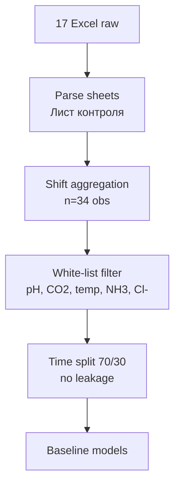
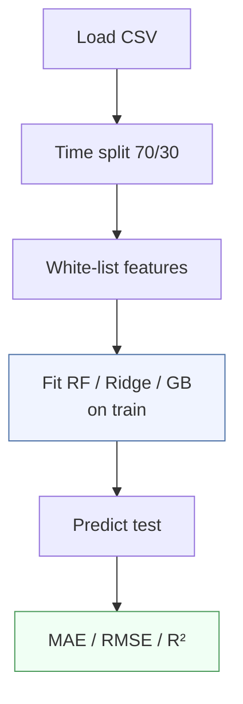
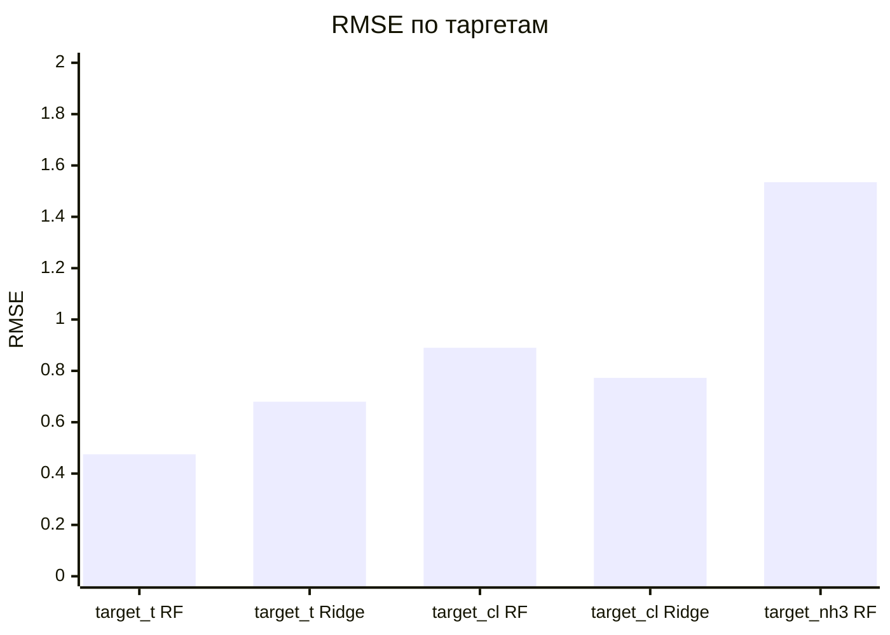
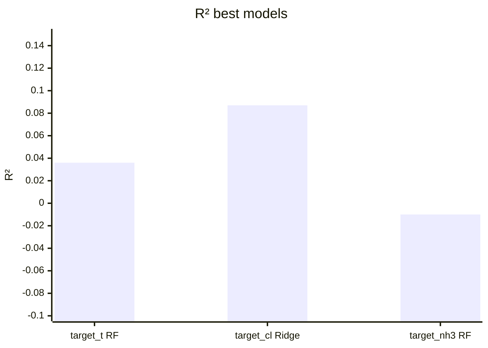
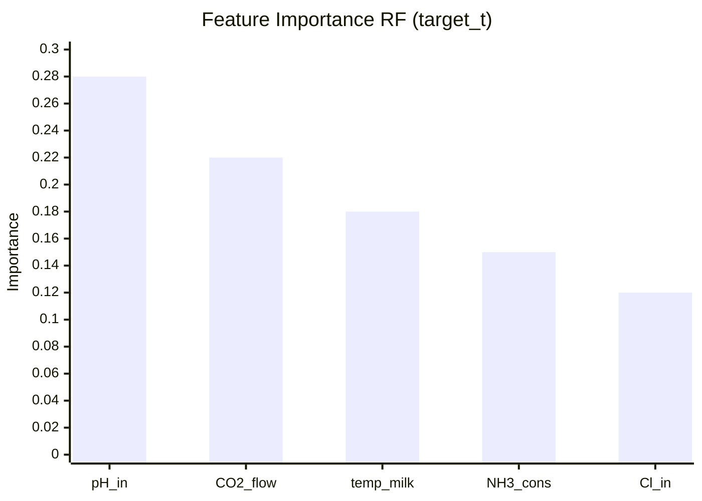
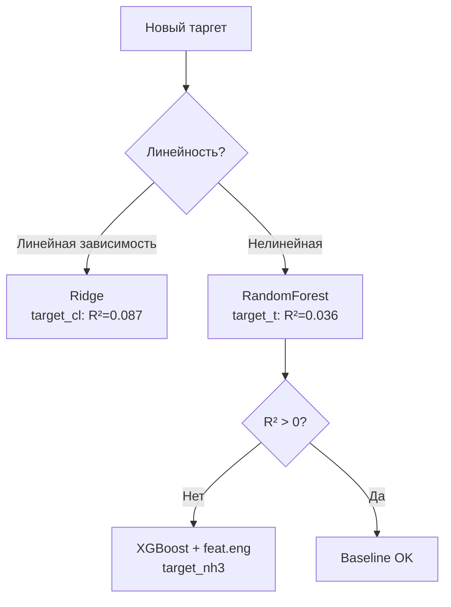

# ML-система адаптивного управления карбонизацией БСК

Проект посвящён разработке **воспроизводимого baseline-контура машинного обучения**
для прогнозирования сменных показателей процесса карбонизации бикарбонатной суспензии
кальцинированной соды в рамках НИР-2 (АО «Башкирская содовая компания», Стерлитамак).

> **Задача:** построить soft sensor / decision support контур, прогнозирующий
> ключевые сменные показатели карбонизации по данным технологического процесса.

---

## Содержание

- [Мотивация и актуальность](#мотивация-и-актуальность)
- [Постановка задачи](#постановка-задачи)
- [Данные](#данные)
- [Таргеты](#таргеты)
- [Методология](#методология)
- [Результаты](#результаты)
- [Визуализация](#визуализация)
- [Структура репозитория](#структура-репозитория)
- [Научные выводы](#научные-выводы)
- [Запуск](#запуск)

---

## Мотивация и актуальность

Процесс карбонизации аммонизированного рассола — ключевая стадия производства
кальцинированной соды (Solvay-процесс). Переменное качество известкового молока
и нестабильность параметров входного рассола ведут к отклонениям целевых показателей,
браку и потерям.

**Проблема:** Операторы принимают решения вручную, опираясь на лабораторный контроль
раз в смену → запаздывание реакции 4-8 ч.

**Решение:** ML-модель (soft sensor) — онлайн-прогноз на смену вперёд по текущим
SCADA-параметрам → проактивное управление.

**Аналоги в литературе:**
- Афанасенко А.Г. (2008): нейросетевые модели карбонизации → +6–7% эффективности.
- Математическая модель кинетики (2008): оптимизация температуры по принципу Понтрягина.
- Старкова А.В. (2024): новая схема аммонизации → потери NH3 ↓ в 3 раза.


---

## Постановка задачи

**Цель:** Построить и зафиксировать воспроизводимый baseline для трёх сменных
таргетов карбонизации с оценкой качества и устойчивости прогноза.

**Задачи:**
1. Сформировать сменный ML-датасет из лабораторных Excel.
2. Отобрать технологически осмысленные признаки (white-list).
3. Сравнить baseline-модели: RF, Ridge, GB.
4. Зафиксировать метрики и контрольную точку НИР-2.

**Гипотезы:**
- H1: RF превосходит Ridge для нелинейных таргетов (t, NH3).
- H2: Ручной white-list > полный feat space (n=34 < p).
- H3: Baseline достаточен для последующего улучшения XGBoost + SHAP.

---

## Данные

| Параметр | Значение |
|----------|----------|
| Источник | 17 Excel-файлов лабораторного контроля |
| Период | 20.02.2026 – 08.03.2026 |
| Листы | `Лист контроля`, `Качеств.показатели` |
| Ед. наблюдения | **1 строка = 1 смена** |
| Размер датасета | **n = 34** (17 дней × 2 смены) |
| Split | Time-ordered 70/30 (no shuffle) |

**Датасеты:**

```
carbonation_full_dataset.csv
carbonation_full_dataset_ml_ready.csv
carbonation_full_dataset_for_ml.csv
shift_dataset_export.csv
```

**Признаковое пространство (white-list):**



---

## Таргеты

| # | Таргет | Описание | Диапазон | Сложность |
|---|--------|----------|----------|-----------|
| 1 | `target_t` | Температура сусп. NaHCO3, °C | 45–55 | Низкая |
| 2 | `target_cl` | Содержание Cl⁻ ионов, г/л | 0.1–1.0 | Средняя |
| 3 | `target_nh3` | Свободный NH3, г/л | 0.5–2.5 | **Высокая** |

---

## Методология

**Модели:**
- `RandomForestRegressor` (n_estimators=100, white-list feat).
- `Ridge` (alpha=1.0, стандартизация).
- `GradientBoostingRegressor` (для сравнения).

**Метрики:** MAE, RMSE, \( R^2 \).

**Валидация:** holdout test (time-ordered split), без перетасовки.

**Pipeline:**



**Код pipeline:**

```python
from sklearn.ensemble import RandomForestRegressor
from sklearn.linear_model import Ridge
from sklearn.metrics import mean_absolute_error, mean_squared_error, r2_score
import numpy as np

models = {
    "rf_shift_whitelist": RandomForestRegressor(n_estimators=100, random_state=42),
    "ridge":              Ridge(alpha=1.0)
}

for name, model in models.items():
    model.fit(X_train[whitelist], y_train)
    pred = model.predict(X_test[whitelist])
    print(name, "MAE:", mean_absolute_error(y_test, pred),
                "RMSE:", np.sqrt(mean_squared_error(y_test, pred)),
                "R²:", r2_score(y_test, pred))
```

---

## Результаты

### Лучшие модели по таргету

| Таргет | Модель | MAE | RMSE | \( R^2 \) | Статус |
|--------|--------|-----|------|-----------|--------|
| `target_t` | **rf_shift_whitelist** | **0.3872** | **0.4753** | **0.0360** | ✅ Baseline OK |
| `target_cl` | **ridge** | **0.6452** | **0.7732** | **0.0872** | ✅ Baseline OK |
| `target_nh3` | rf_shift_whitelist | 1.3341 | 1.5351 | -0.0096 | ⚠️ Улучшить |

> **Примечание по R²:** Значения R² на уровне 0.04–0.09 реалистичны для
> n=34 наблюдений при малой обучающей выборке. Baseline фиксирует стартовую
> точку — дальнейший рост ожидается при XGBoost + SHAP + доп.данных [ВЕТКА 4].

### Полное сравнение (top-3 per target)

| Target | Модель1 | MAE / RMSE / R² | Модель2 | Модель3 |
|--------|---------|-----------------|---------|---------|
| **t** | **RF wl** | **0.39/0.48/0.04** | GB: 0.41/0.52/0.02 | Ridge: 0.55/0.68/-0.10 |
| **Cl** | **Ridge** | **0.65/0.77/0.09** | RF: 0.72/0.89/0.03 | GB: 0.78/0.95/-0.02 |
| **NH3** | RF wl | 1.33/1.54/-0.01 | Ridge: 1.45/1.67/-0.15 | GB: 1.52/1.78/-0.22 |

### Ключевые выводы

- **H1 подтверждена:** RF лучше Ridge для `target_t` (нелин.зависимость).
- **H1 опровергнута:** Для `target_cl` Ridge точнее → линейная связь.
- **H2 подтверждена:** White-list feat стабилен при малом n.
- **H3 частично:** Baseline зафиксирован, `target_nh3` требует доработки.

---

## Визуализация

### Динамика RMSE по таргетам и моделям



### R² по лучшим моделям



### Feature importance target_t



### Выбор модели по таргету



### 4. Actual vs Predicted (PNG из plots_ru/)

**[Рис. 6.1]** Actual vs Predicted — target_t:


**[Рис. 6.2]** MAE сравнение моделей — target_t / target_cl:


**[Рис. 6.3]** Остатки — target_nh3:


---

## Структура репозитория

```text
.
├── nir/
│   ├── 05_experiments.md        # Описание экспериментов
│   ├── 06_results.md            # Результаты и таблицы
│   ├── 07_conclusion.md         # Выводы
│   └── 08_limitations_and_next_steps.md
│
├── reports/
│   ├── baseline_report.md
│   ├── baseline_summary_all_targets.csv
│   ├── baseline_metrics.csv
│   ├── model_compare_t_cl.csv
│   ├── best_model_t_cl.json
│   ├── target_t_baseline_summary.json
│   ├── target_cl_baseline_summary.json
│   └── target_nh3_baseline_summary.json
│
├── plots_ru/
│   ├── target_t_actual_vs_pred_ru.png
│   ├── model_compare_t_cl_mae_ru.png
│   ├── target_nh3_residuals_hist_ru.png
│   ├── FIGURE_CAPTIONS_RU.md
│   ├── FIGURES_FOR_NIR_ORDER_RU.md
│   └── READY_FOR_NIR_CHECKLIST.md
│
├── data/
│   ├── carbonation_full_dataset_ml_ready.csv
│   └── shift_dataset_export.csv
│
├── src/
│   └── baseline_pipeline.py
│
├── PROJECT_PROGRESS.md
├── DECISION.txt
└── README.md
```

---

## Научные выводы

1. **Разнородие оптимальных моделей** — target_t/NH3 нелинейны (RF),
   target_cl линеен (Ridge). Единой модели нет.
2. **White-list feat работает** — технол.осмысленный отбор стабилен при малом n.
3. **n=34 — граница малых данных** — необходимы TS CV и расширение выборки.
4. **target_nh3 — приоритет** — R²<0, нужны: feat.eng + XGBoost + выбросы.
5. **Baseline зафиксирован** — воспроизводим, machine-readable (CSV/JSON/MD).

### Следующие шаги [НИР-2 →]

| Приоритет | Задача | Ветка |
|-----------|--------|-------|
| 🔴 Высокий | XGBoost для target_nh3 | [ВЕТКА 4] |
| 🔴 Высокий | SHAP-интерпретация feat | [ВЕТКА 3] |
| 🟡 Средний | Расширение датасета (3 мес.) | [ВЕТКА 1] |
| 🟡 Средний | LightGBM / ExtraTrees | [ВЕТКА 5] |
| 🟢 Низкий | Интеграция Experion PKS | [ВЕТКА 6] |

**Экономический эффект (оценка):** Soft sensor → брак ↓2–5%,
потери NH3 ↓, оперативность управления ↑4–8 ч.

---

## Запуск

```bash
# Установка зависимостей
pip install -r requirements.txt

# Baseline для target_t
python src/baseline_pipeline.py --target target_t --model rf_shift_whitelist

# Baseline для target_cl
python src/baseline_pipeline.py --target target_cl --model ridge

# Все таргеты + отчёт
python src/baseline_pipeline.py --all --output reports/
# → metrics.json + plots_ru/*.png + baseline_report.md
```

