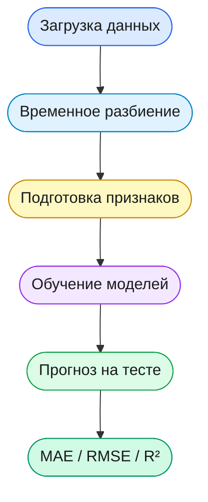
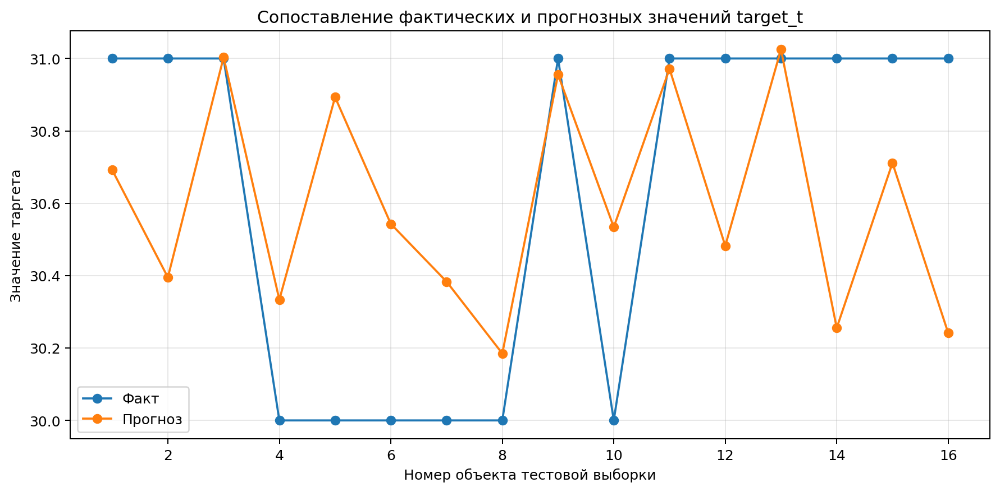
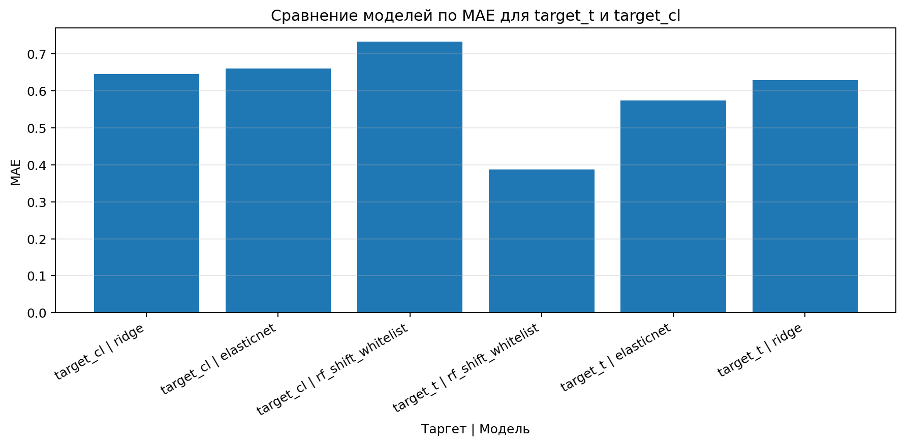
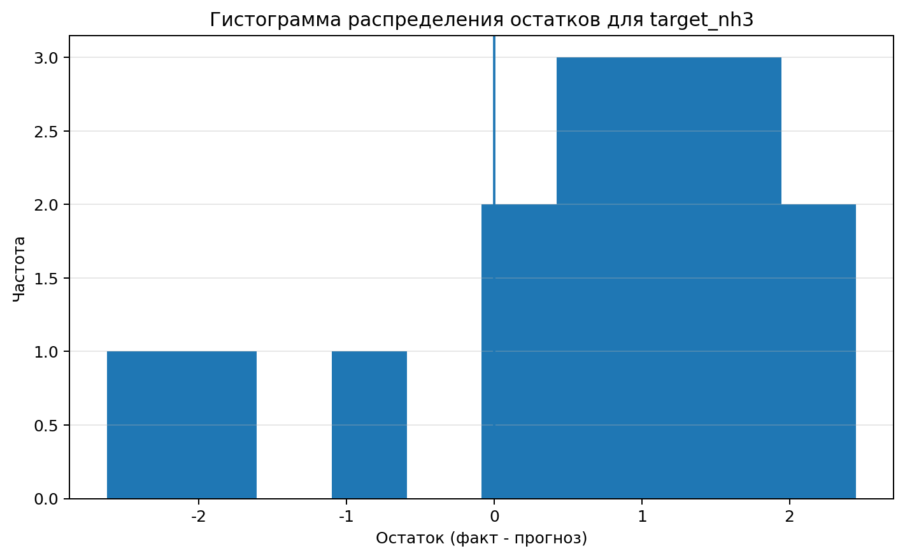
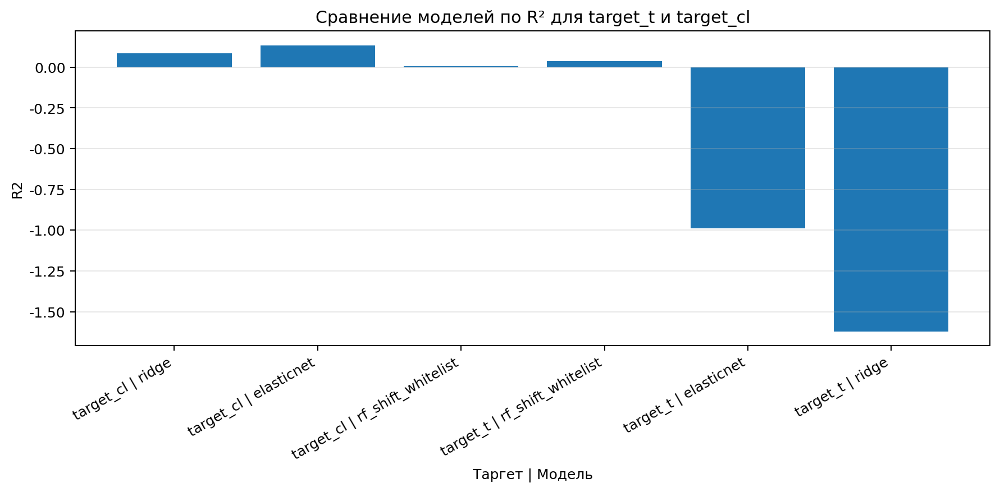

# ML-система управления карбонизацией | БСК

<!-- README v1.3 | НИР-2 | дата фиксации: 15.03.2026 -->
<!-- Статус: главный README репозитория + выделенный блок флагманского проекта soda-ml-nir_targetB_v6 -->
<!-- Примечание: структуру экспериментальных папок пока не унифицируем, чтобы не ломать ссылки и графики -->

[](https://python.org)
[](https://scikit-learn.org)
[](https://xgboost.readthedocs.io)
[]()
[]()

Этот репозиторий — практическая часть НИР-2 по применению машинного обучения
в производстве кальцинированной соды (АО «Башкирская содовая компания», Стерлитамак).

Цель — построить **soft sensor**: модель, которая по текущим параметрам процесса
предсказывает ключевые показатели карбонизации на смену вперёд.
Это позволяет оператору реагировать проактивно, а не после накопления отклонения.

---

## Содержание

- [Зачем это нужно](#зачем-это-нужно)
- [Статус репозитория](#статус-репозитория)
- [Что исследуется](#что-исследуется)
- [Данные](#данные)
- [Методология](#методология)
- [Результаты](#результаты)
- [Графики](#графики)
- [Эксперименты](#эксперименты)
- [Флагманский проект: soda-ml-nir_targetB_v6](#флагманский-проект-soda-ml-nir_targetb_v6)
- [Исследования и материалы](#исследования-и-материалы)
- [Структура репозитория](#структура-репозитория)
- [Выводы](#выводы)
- [Запуск](#запуск)

---

## Зачем это нужно

Процесс карбонизации аммонизированного рассола — центральная стадия
аммиачно-содового процесса (метод Сольве).
На практике лабораторный контроль выполняется раз в смену, и если что-то пошло не так,
оператор узнаёт об этом с задержкой 4–8 часов.
За это время возможны:
- рост брака,
- перерасход реагентов,
- дополнительная нагрузка на оборудование.

ML-модель решает эту проблему: она обучается на исторических данных SCADA
и лабораторного контроля и выдаёт прогноз до того, как отклонение успевает накопиться.

```mermaid
flowchart LR
    A([SCADA\nпараметры]) --> B([ML soft sensor])
    B --> C([Прогноз\nна смену])
    C --> D([Оператор\nреагирует заранее])
    D --> E([Снижение брака\nи потерь])

    style A fill:#dbeafe,stroke:#2563eb,color:#1a1a1a
    style B fill:#fef9c3,stroke:#ca8a04,color:#1a1a1a
    style C fill:#dcfce7,stroke:#16a34a,color:#1a1a1a
    style D fill:#f3e8ff,stroke:#9333ea,color:#1a1a1a
    style E fill:#d1fae5,stroke:#059669,color:#1a1a1a
````

---

## Статус репозитория

Репозиторий содержит несколько отдельных экспериментальных проектов в папке [`experiments/`](experiments/).

Текущие приоритеты:

1. **`target_t`** — приоритет №1
2. **`target_cl`** — приоритет №2
3. **`target_nh3`** — приоритет №3

Текущий флагманский проект:

* [`soda-ml-nir_targetB_v6`](experiments/soda-ml-nir_targetB_v6/)

Важно:

* структура экспериментальных папок пока **не полностью унифицирована**;
* часть материалов внутри `v6` содержит следы предыдущих этапов и промежуточных версий;
* на текущем этапе это не исправляется, чтобы не ломать ссылки, графики и рабочую навигацию.

---

## Что исследуется

В рамках НИР-2 строится базовая ML-система для прогноза трёх сменных показателей карбонизации.

| Таргет       | Описание                         | Сложность прогноза | Приоритет |
| ------------ | -------------------------------- | ------------------ | --------- |
| `target_t`   | Температура суспензии NaHCO₃, °C | Низкая             | №1        |
| `target_cl`  | Содержание ионов Cl⁻, г/л        | Средняя            | №2        |
| `target_nh3` | Свободный NH₃, г/л               | Высокая            | №3        |

Основная гипотеза:
нелинейные модели (`Random Forest`, `XGBoost`, `Gradient Boosting`) дадут преимущество
над линейной моделью там, где технологические зависимости выражены нелинейно,
а технологически осмысленный отбор признаков будет устойчивее
полностью автоматического отбора на малой выборке.

---

## Данные

В репозитории используются несколько наборов данных и несколько уровней агрегации:

* сменные лабораторные данные,
* SCADA-параметры,
* агрегированные окна,
* производные датасеты по конкретным таргетам и сценариям.

Для baseline-исследований использовались:

* 17 дней лабораторного контроля,
* 34 смены,
* временное разбиение без перемешивания.

Для `targetB_v6` используется отдельная экспериментальная ветка данных,
включающая расширенные таблицы, SCADA-источники и подготовленные промежуточные наборы.

```mermaid
flowchart TD
    A([Лабконтроль]) --> B([Агрегация по сменам])
    C([SCADA]) --> D([Фичи процесса])
    B --> E([Объединение])
    D --> E
    E --> F([Train / Test по времени])
    F --> G([ML модели])

    style A fill:#dbeafe,stroke:#2563eb,color:#1a1a1a
    style B fill:#e0f2fe,stroke:#0284c7,color:#1a1a1a
    style C fill:#dbeafe,stroke:#2563eb,color:#1a1a1a
    style D fill:#fef9c3,stroke:#ca8a04,color:#1a1a1a
    style E fill:#f3e8ff,stroke:#9333ea,color:#1a1a1a
    style F fill:#dcfce7,stroke:#16a34a,color:#1a1a1a
    style G fill:#d1fae5,stroke:#059669,color:#1a1a1a
```

---

## Методология

В репозитории сравниваются несколько подходов:

* `RandomForestRegressor`
* `Ridge`
* `GradientBoostingRegressor`
* `XGBoost`
* отбор признаков по важности
* lag-признаки
* разделение сценариев `with_offgas` / `no_offgas`
* walk-forward / time split

Метрики качества:

* **MAE**
* **RMSE**
* **R²**

Принцип валидации:

* без перемешивания,
* с сохранением временного порядка,
* на отложенной тестовой выборке или через временные сплиты.



---

## Результаты

На текущем этапе репозиторий хранит не один результат, а набор результатов по нескольким веткам исследований.

Ключевые выводы по baseline-направлению:

* для `target_t` наилучшие результаты показывают ансамблевые методы;
* для `target_cl` линейная модель в ряде постановок остаётся конкурентной;
* `target_nh3` остаётся самым трудным таргетом и требует расширения признаков и более сильной инженерии данных.

Ключевой вывод по структуре исследований:

* нет одной универсально лучшей модели для всех технологических показателей;
* подход должен быть **таргет-специфичным**;
* рост качества сильнее зависит от качества признаков и постановки задачи,
  чем от простой замены одного алгоритма другим.

---

## Графики

Ниже оставлены основные графики из корневой структуры репозитория.
Это сделано специально, чтобы визуализации отображались стабильно на главной странице.

**Факт vs Прогноз — `target_t`:**


**Сравнение MAE — `target_t` / `target_cl`:**


**Остатки — `target_nh3`:**


**Сравнение R²:**


Примечание:
часть графиков внутри отдельных экспериментальных папок может не отображаться
при механическом копировании README между уровнями репозитория.
Поэтому корневой README остаётся основной точкой навигации и просмотра ключевых визуализаций.

---

## Эксперименты

На текущий момент в каталоге [`experiments/`](experiments/) размещены 6 проектов.

### 1. [soda-ml-nir_targetB_v6](experiments/soda-ml-nir_targetB_v6/)

Флагманская экспериментальная ветка.
Содержит расширенную постановку по `target1 / B1`, данные, промежуточные датасеты,
несколько этапов экспериментов и накопленные артефакты.

> [Открыть папку](experiments/soda-ml-nir_targetB_v6/) · [README проекта](experiments/soda-ml-nir_targetB_v6/README.md)

---

### 2. [rf_tuning_v5](experiments/rf_tuning_v5/)

Сравнение `Random Forest` и `XGBoost` для показателя `k1`.
Содержит отдельный notebook, отчёты, графики и метрики.

> [Открыть папку](experiments/rf_tuning_v5/) · [README проекта](experiments/rf_tuning_v5/README.md)

---

### 3. [soda-ml-nir_baseline_v1](experiments/soda-ml-nir_baseline_v1/)

Базовая baseline-версия:

* исходная постановка,
* базовые модели,
* стандартные метрики,
* первый фиксированный набор отчётов.

> [Открыть папку](experiments/soda-ml-nir_baseline_v1/) · [README проекта](experiments/soda-ml-nir_baseline_v1/README.md)

---

### 4. [soda-ml-nir_baseline_v2](experiments/soda-ml-nir_baseline_v2/)

Расширение baseline-подхода:

* сравнение режимов `with_offgas` / `no_offgas`,
* дополнительные отчёты,
* уточнённые сравнения моделей.

> [Открыть папку](experiments/soda-ml-nir_baseline_v2/) · [README проекта](experiments/soda-ml-nir_baseline_v2/README.md)

---

### 5. [soda-ml-nir_lags_v3](experiments/soda-ml-nir_lags_v3/)

Версия с lag-признаками:

* временные лаги,
* baseline + lag-feature engineering,
* сравнительные отчёты и графики.

> [Открыть папку](experiments/soda-ml-nir_lags_v3/) · [README проекта](experiments/soda-ml-nir_lags_v3/README.md)

---

### 6. [soda-ml-nir_lags_no_offgas_v4](experiments/soda-ml-nir_lags_no_offgas_v4/)

Версия с lag-признаками без учёта offgas:

* отдельная экспериментальная постановка,
* сравнение с предыдущими baseline-ветками,
* собственные отчёты и метрики.

> [Открыть папку](experiments/soda-ml-nir_lags_no_offgas_v4/) · [README проекта](experiments/soda-ml-nir_lags_no_offgas_v4/README.md)

---

## Флагманский проект: soda-ml-nir_targetB_v6

### Что это

[`soda-ml-nir_targetB_v6`](experiments/soda-ml-nir_targetB_v6/) — текущий флагманский проект репозитория.

Он важен потому что:

* содержит наиболее развитую экспериментальную ветку,
* включает расширенную структуру данных,
* фиксирует несколько этапов исследования внутри одной папки,
* используется как опорная версия для дальнейшей НИР и магистерской работы.

### Важное замечание по структуре

Внутри `v6` сейчас сохранены:

* собственные рабочие материалы,
* артефакты предыдущих этапов,
* промежуточные таблицы,
* отчёты нескольких подэкспериментов.

Это не идеальная финальная структура, но на текущем этапе она сохранена намеренно,
чтобы не ломать:

* ссылки,
* README,
* графики,
* рабочую воспроизводимость.

### Куда смотреть в первую очередь

* [Папка проекта](experiments/soda-ml-nir_targetB_v6/)
* [README проекта](experiments/soda-ml-nir_targetB_v6/README.md)
* [Outputs проекта](experiments/soda-ml-nir_targetB_v6/outputs/)
* [Reports проекта](experiments/soda-ml-nir_targetB_v6/reports/)

### Что будет позже

Структурная чистка `v6`, разбор дублей и унификация экспериментальных папок
планируются отдельным этапом, а не в рамках текущей правки README.

---

## Исследования и материалы

Ниже — быстрые ссылки на основные направления работы.

### Исследовательские проекты

* [`experiments/soda-ml-nir_targetB_v6/`](experiments/soda-ml-nir_targetB_v6/)
* [`experiments/rf_tuning_v5/`](experiments/rf_tuning_v5/)
* [`experiments/soda-ml-nir_baseline_v1/`](experiments/soda-ml-nir_baseline_v1/)
* [`experiments/soda-ml-nir_baseline_v2/`](experiments/soda-ml-nir_baseline_v2/)
* [`experiments/soda-ml-nir_lags_v3/`](experiments/soda-ml-nir_lags_v3/)
* [`experiments/soda-ml-nir_lags_no_offgas_v4/`](experiments/soda-ml-nir_lags_no_offgas_v4/)

### Материалы НИР

* [`nir/`](nir/)
* [`reports/`](reports/)
* [`plots_ru/`](plots_ru/)
* [`plots/`](plots/)

---

## Структура репозитория

```text
.
├── experiments/
│   ├── rf_tuning_v5/
│   ├── soda-ml-nir_baseline_v1/
│   ├── soda-ml-nir_baseline_v2/
│   ├── soda-ml-nir_lags_no_offgas_v4/
│   ├── soda-ml-nir_lags_v3/
│   └── soda-ml-nir_targetB_v6/
├── nir/                ← главы НИР и текстовые материалы
├── reports/            ← сводные отчёты и метрики
├── plots/              ← графики
├── plots_ru/           ← русифицированные графики для НИР
├── .gitignore
└── README.md           ← главный README репозитория
```

---

## Выводы

Главный вывод: репозиторий перешёл от одной локальной baseline-постановки
к набору параллельных экспериментальных веток.

Что уже есть:

* baseline-версии,
* версии с lag-признаками,
* отдельная ветка RF/XGBoost,
* флагманский проект `soda-ml-nir_targetB_v6`.

Что важно дальше:

* сохранить ясную навигацию по экспериментам,
* не потерять воспроизводимость,
* постепенно унифицировать структуру папок,
* развивать приоритетные таргеты в порядке:
  `target_t` → `target_cl` → `target_nh3`.

---

## Запуск

Набор команд зависит от конкретного проекта внутри `experiments/`.
Поэтому запуск лучше смотреть в README нужной папки.

Общая логика:

```bash
pip install -r requirements.txt
```

Далее перейти в нужный эксперимент и запускать его код согласно локальному README.

Примеры:

* [`experiments/rf_tuning_v5/README.md`](experiments/rf_tuning_v5/README.md)
* [`experiments/soda-ml-nir_targetB_v6/README.md`](experiments/soda-ml-nir_targetB_v6/README.md)

---

*НИР-2 · УГНТУ · кафедра АТП · 2026 · АО «БСК», Стерлитамак*

````

