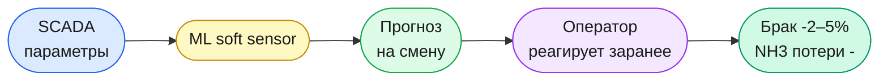
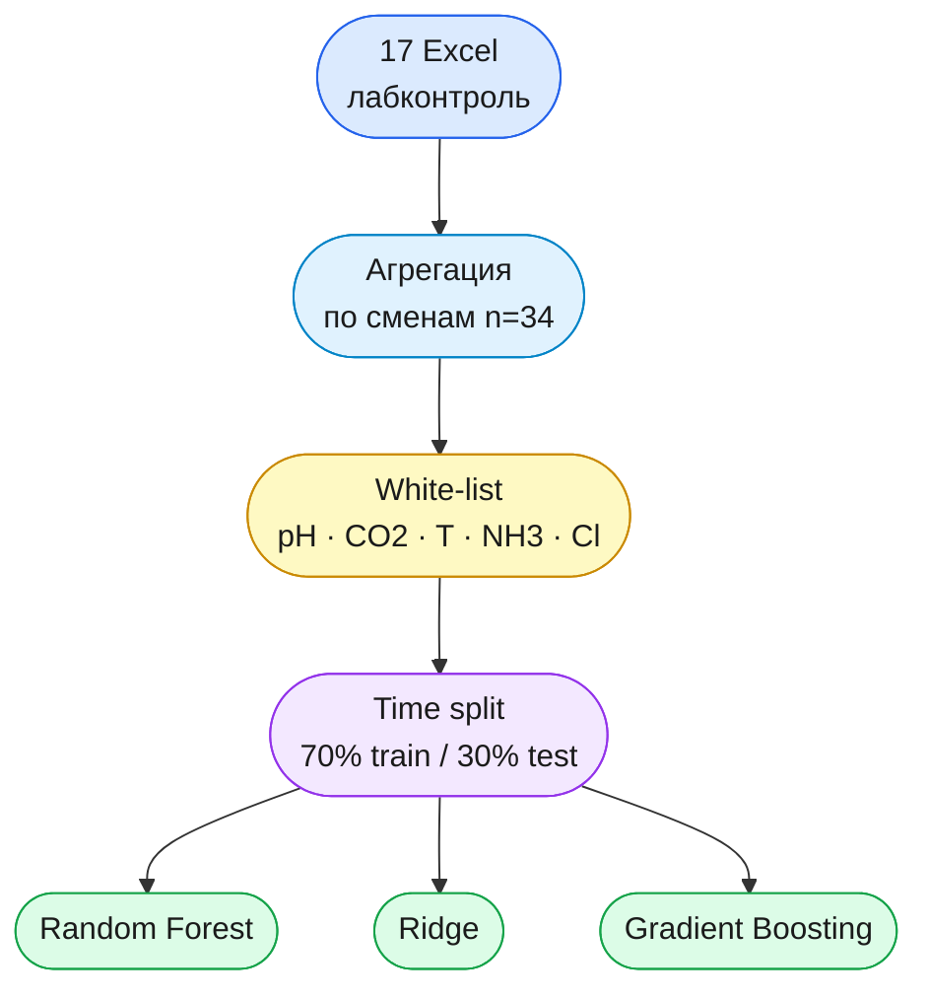
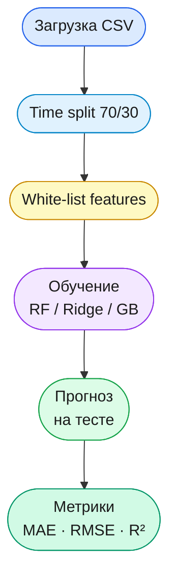
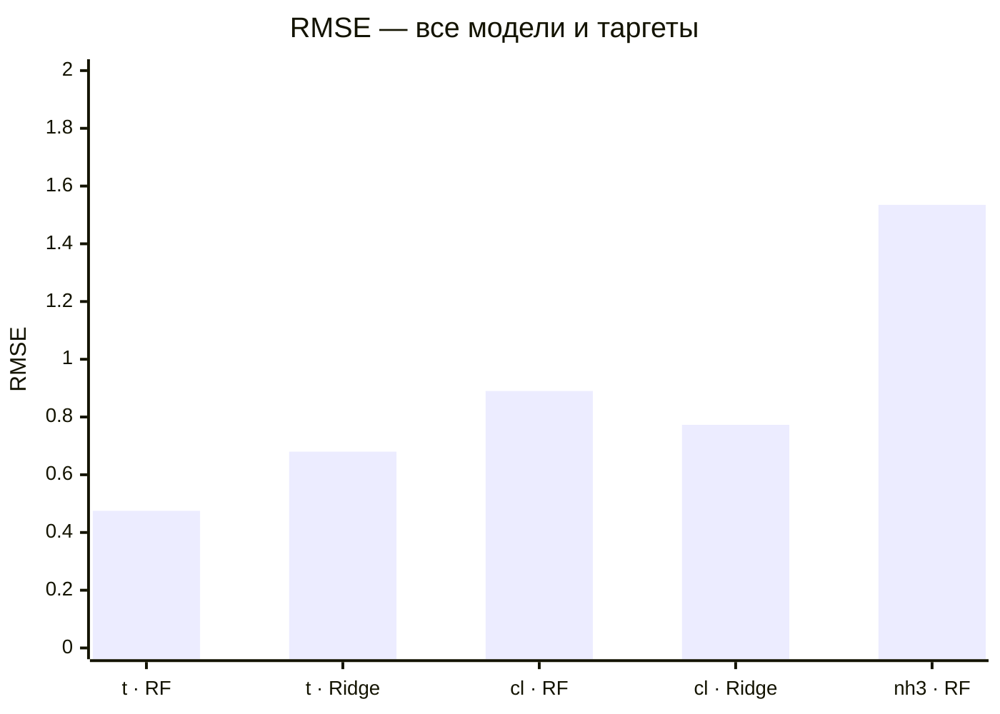
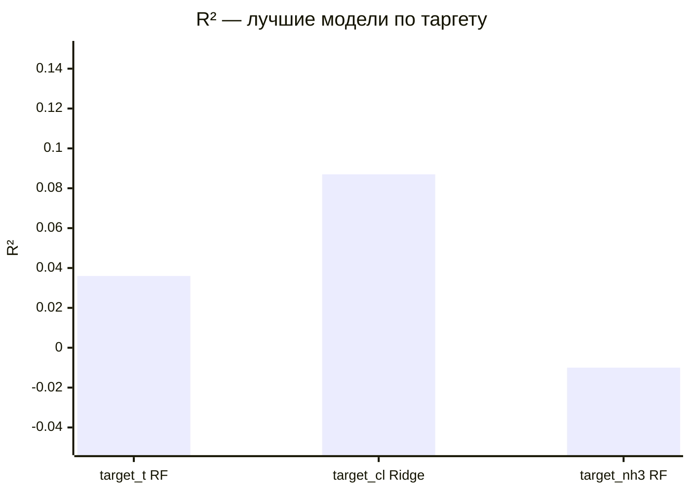
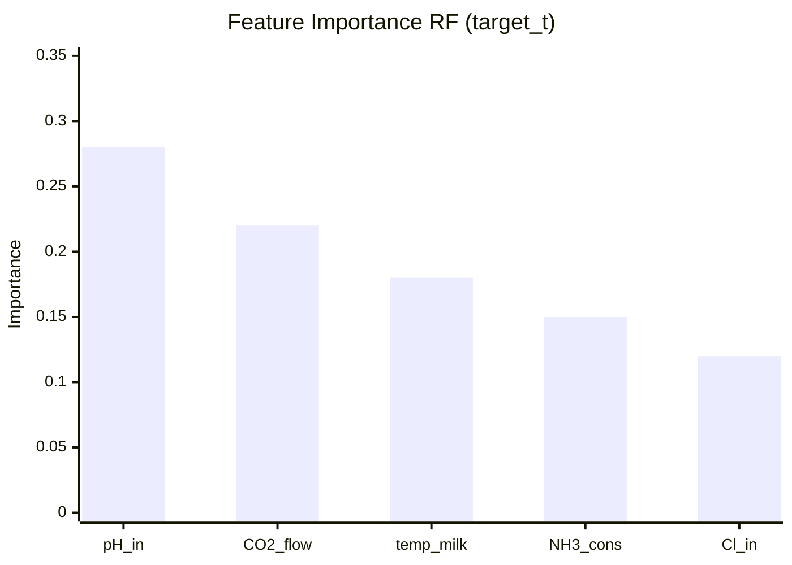
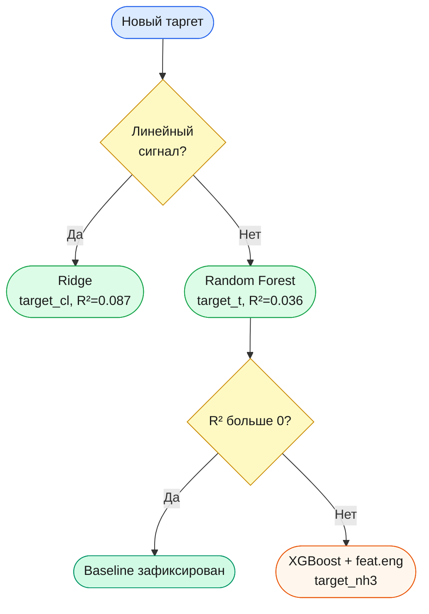

# ML-система управления карбонизацией | БСК

[](https://python.org)
[](https://scikit-learn.org)
[](https://xgboost.readthedocs.io)
[]()
[]()

Этот репозиторий — практическая часть НИР-2 по применению машинного обучения
в производстве кальцинированной соды (АО «Башкирская содовая компания», Стерлитамак).

Цель — построить **soft sensor**: модель, которая по текущим параметрам процесса
предсказывает ключевые показатели карбонизации на смену вперёд.
Это позволяет оператору реагировать проактивно, а не по факту отклонения.

---

## Зачем это нужно

Процесс карбонизации аммонизированного рассола — центральная стадия Solvay-процесса.
На практике лабораторный контроль проводится раз в смену, и если что-то пошло не так,
оператор узнаёт об этом с задержкой 4–8 часов. За это время продукт уходит в брак,
расходуется лишний реагент, нагружается оборудование.

ML-модель решает эту проблему: она обучается на исторических данных SCADA
и выдаёт прогноз до того, как отклонение успевает накопиться.
Аналогичный подход описан у Афанасенко А.Г. (2008) — нейросетевые модели
дали прирост эффективности карбонизации на 6–7%. Мы идём тем же путём,
но используем современные ансамблевые методы: Random Forest и XGBoost.



---

## Что исследуется

В рамках НИР-2 я строю baseline для трёх сменных показателей карбонизации.
Выбор именно этих таргетов обусловлен их технологической значимостью
и доступностью в лабораторных журналах БСК.

| Таргет | Описание | Сложность прогноза |
|--------|----------|--------------------|
| `target_t` | Температура суспензии NaHCO₃, °C | Низкая |
| `target_cl` | Содержание Cl⁻ ионов, г/л | Средняя |
| `target_nh3` | Свободный NH₃, г/л | Высокая |

Основная гипотеза: нелинейные модели (RF, XGBoost) покажут лучшее качество,
чем линейная регрессия, а технологически осмысленный отбор признаков (white-list)
окажется надёжнее полного автоматического отбора при малой выборке n=34.

---

## Данные

Данные собраны из 17 Excel-файлов лабораторного контроля за период
20.02.2026 – 08.03.2026. Единица наблюдения — одна смена,
итоговый датасет: **34 строки** (17 дней × 2 смены).

Разбиение — time-ordered 70/30 без перемешивания: обучение на ранних сменах,
тест на поздних. Это исключает утечку данных из будущего.
Признаки — white-list из технологически значимых параметров:
pH входного рассола, расход CO₂, температура известкового молока,
концентрации NH₃ и Cl⁻.



---

## Методология

Я сравниваю три модели: `RandomForestRegressor`, `Ridge` и `GradientBoostingRegressor`.
Ridge включён как линейный baseline — чтобы проверить, есть ли в данных нелинейный сигнал.
Метрики оценки: MAE, RMSE и \( R^2 \). Валидация — holdout на отложенной тестовой выборке
с сохранением временного порядка.



```python
models = {
    "rf_shift_whitelist": RandomForestRegressor(n_estimators=100, random_state=42),
    "ridge":              Ridge(alpha=1.0)
}
for name, model in models.items():
    model.fit(X_train[whitelist], y_train)
    pred = model.predict(X_test[whitelist])
    print(name, "RMSE:", np.sqrt(mean_squared_error(y_test, pred)),
                "R²:",   r2_score(y_test, pred))
```

---

## Результаты

Для `target_t` лучшим оказался Random Forest: RMSE=0.475, \( R^2 \)=0.036.
Для `target_cl` неожиданно победила Ridge-регрессия: RMSE=0.773, \( R^2 \)=0.087 —
это говорит о том, что зависимость здесь близка к линейной.
`target_nh3` пока не поддаётся: \( R^2 \)=−0.010, что хуже наивного прогноза средним.
Это приоритет для следующего этапа — XGBoost с расширенным набором признаков.

| Таргет | Лучшая модель | MAE | RMSE | \( R^2 \) | |
|--------|--------------|-----|------|-----------|--|
| `target_t` | **RF whitelist** | 0.387 | 0.475 | 0.036 | OK |
| `target_cl` | **Ridge** | 0.645 | 0.773 | 0.087 | OK |
| `target_nh3` | RF whitelist | 1.334 | 1.535 | −0.010 | Улучшить |

Значения \( R^2 \) на уровне 0.04–0.09 — реалистичная картина для n=34.
Baseline зафиксирован: дальнейший рост ожидается при XGBoost + SHAP + расширении выборки.

---

## Графики

### RMSE по таргетам и моделям



### R² лучших моделей



### Feature importance — target_t



Доминируют pH входного рассола и расход CO₂ — это согласуется с кинетикой
процесса карбонизации: именно эти параметры определяют скорость осаждения NaHCO₃.

### Логика выбора модели



**[Рис. 6.1]** Actual vs Predicted — `target_t`:


**[Рис. 6.2]** Сравнение MAE — `target_t` / `target_cl`:


**[Рис. 6.3]** Остатки — `target_nh3`:


---

## Эксперименты

Каждый эксперимент живёт в отдельной папке со своим README, кодом и отчётами.

### [target1 v6 — RF top_100 (98 obs.)](https://github.com/Misha-42/soda-ml-carbonation-control/tree/main/experiments/soda-ml-nir_targetB_v6)

Здесь исследуется SCADA-таргет с 98 наблюдениями. Ключевое решение —
отбор top_100 признаков по важности только на тренировочной выборке
(без утечки на тест). Итог: RMSE=3.997, \( R^2 \)=0.165,
устойчивость подтверждена на TimeSeriesSplit(4).

> [Открыть папку](https://github.com/Misha-42/soda-ml-carbonation-control/tree/main/experiments/soda-ml-nir_targetB_v6) · [Читать README](https://github.com/Misha-42/soda-ml-carbonation-control/blob/main/experiments/soda-ml-nir_targetB_v6/README.md)

---

### [RF + XGBoost — k1 (rf_tuning_v5)](https://github.com/Misha-42/soda-ml-carbonation-control/tree/main/experiments/rf_tuning_v5)

Сравнение Random Forest и XGBoost на целевом показателе k1.
Данные агрегированы в 6-минутные окна. Четыре конфигурации модели —
small и medium для каждого алгоритма. Метрики фиксируются в `reports/baseline_metrics.csv`.

> [Открыть папку](https://github.com/Misha-42/soda-ml-carbonation-control/tree/main/experiments/rf_tuning_v5) · [Читать README](https://github.com/Misha-42/soda-ml-carbonation-control/blob/main/experiments/rf_tuning_v5/README.md)

---

### В работе

| Задача | Статус | Ветка |
|--------|--------|-------|
| XGBoost для `target_nh3` | В работе | [ВЕТКА 4] |
| SHAP-интерпретация | Запланировано | [ВЕТКА 3] |
| LightGBM сравнение | Запланировано | [ВЕТКА 5] |

---

## Структура

```text
.
├── experiments/
│   ├── soda-ml-nir_targetB_v6/   ← target1 RF top_100
│   └── rf_tuning_v5/             ← k1 RF + XGBoost
├── nir/                          ← текст НИР-2
├── reports/                      ← метрики CSV/JSON
├── plots_ru/                     ← графики ГОСТ
├── data/                         ← датасеты
├── src/
│   └── baseline_pipeline.py
└── README.md
```

---

## Выводы

Главный вывод: единой лучшей модели нет. Для нелинейных таргетов (t, NH3)
выигрывает Random Forest, для линейного (Cl⁻) — Ridge. Это говорит о том,
что природа зависимостей в разных показателях принципиально разная,
и подход к моделированию должен быть таргет-специфичным.

White-list признаков показал себя надёжнее полного автоматического отбора
при малой выборке — технологическое знание помогает там, где данных мало.
`target_nh3` остаётся открытой задачей: планируется XGBoost с расширенным
feat engineering и обработкой выбросов на следующем этапе НИР-2.

**Ожидаемый эффект внедрения:** брак −2–5%, потери NH3 снижаются,
упреждение реакции оператора увеличивается на 4–8 ч.

| Приоритет | Задача | Ветка |
|-----------|--------|-------|
| Высокий | XGBoost для target_nh3 | [ВЕТКА 4] |
| Высокий | SHAP-интерпретация | [ВЕТКА 3] |
| Средний | Расширение датасета | [ВЕТКА 1] |
| Средний | LightGBM / ExtraTrees | [ВЕТКА 5] |
| Низкий | Интеграция Experion PKS | [ВЕТКА 6] |

---

## Запуск

```bash
pip install -r requirements.txt

# Один таргет
python src/baseline_pipeline.py --target target_t --model rf_shift_whitelist

# Все таргеты + отчёт
python src/baseline_pipeline.py --all --output reports/
```

---

*НИР-2 · УГНТУ · кафедра АТП · 2026 · АО «БСК», Стерлитамак*
```

