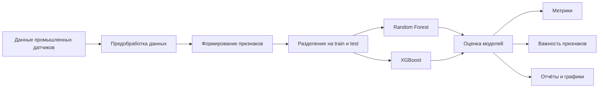
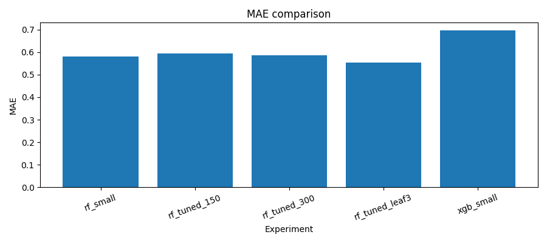
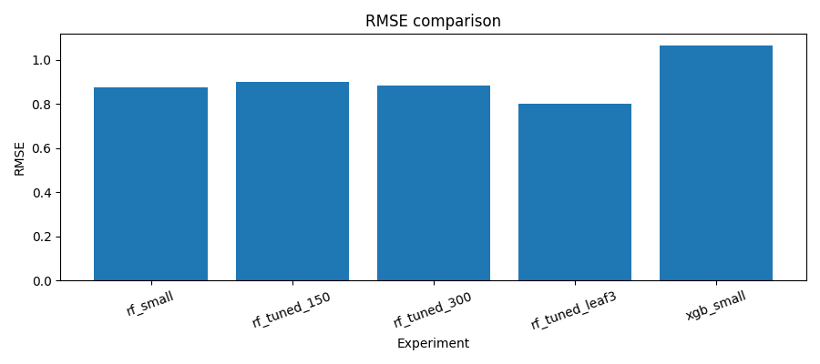
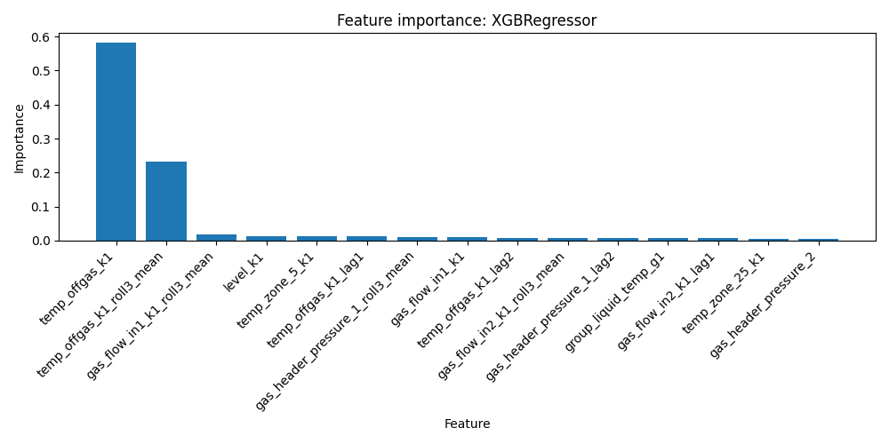

# Базовый ML-проект для процесса карбонизации соды: Random Forest и XGBoost

ML-baseline проект для НИР по анализу технологического процесса производства кальцинированной соды.

Цель текущего этапа — быстро построить воспроизводимый baseline и сравнить две модели:

- RandomForestRegressor
- XGBRegressor

Проект используется как основа для дальнейших экспериментов и развития ML-модели управления процессом карбонизации.

---

## Обзор проекта

Процесс карбонизации — сложная нелинейная система, в которой множество технологических параметров влияет на целевой показатель процесса.

Цель ML-модели: предсказать целевой параметр процесса (например, `k1`) на основе данных промышленных датчиков.

Этот репозиторий содержит минимальный pipeline:

`данные → предобработка → генерация признаков → обучение → оценка → отчёты`

---

## Схема ML-pipeline



---

## Структура репозитория

```text
rf_tuning_v5
│
├── data/                # входные данные
├── models/              # сохранённые модели
├── nir/                 # текст НИР (структура исследования)
├── reports/             # метрики, графики и отчёты
├── src/                 # код pipeline
│
├── requirements.txt     # зависимости
└── README.md
```

---

## Данные

Данные должны лежать в папке:

```text
data/
```

Пример:

```text
data/baseline_k1_6min_real.csv
```

CSV-файл должен содержать:

| Колонка | Описание |
|---|---|
| target | целевая переменная |
| timestamp | временная колонка (необязательно) |

Если присутствует `timestamp`, используется разбиение по времени (`time-based split`).

---

## Компоненты ML-pipeline

### `src/data_prep.py`
- загрузка CSV
- очистка данных
- проверка обязательных колонок
- разделение train/test

### `src/features.py`
- выбор числовых признаков
- обработка пропусков

### `src/train_baseline.py`
Обучает модели:
- RandomForest
- XGBoost

### `src/evaluate.py`
- вычисляет метрики
- сохраняет отчёты
- строит графики

---

## Быстрый запуск baseline-эксперимента

Установка зависимостей:

```bash
pip install -r requirements.txt
```

Запуск обучения:

```bash
python src/train_baseline.py \
    --data-path data/baseline_k1_6min_real.csv \
    --target target \
    --time-column timestamp
```

Если временной колонки нет:

```bash
python src/train_baseline.py --data-path data/file.csv --target target
```

---

## Сохраняемые модели

После обучения сохраняются модели:

```text
models/
├── rf_small.joblib
├── rf_medium.joblib
├── xgb_small.joblib
└── xgb_medium.joblib
```

---

## Отчёты и результаты

Все результаты сохраняются в:

```text
reports/
```

Основные файлы:

```text
baseline_metrics.csv
experiments_summary.csv
baseline_report.md
rf_tuning_v5_metrics.csv
rf_tuning_v5_report.md
rf_tuning_v5_experiments_summary.csv
```

---

## Ключевые результаты

### Сравнение моделей по MAE


### Сравнение моделей по RMSE


### Важность признаков для Random Forest


### Важность признаков для XGBoost


---

## Метрики

Для каждого эксперимента сохраняются:

| Метрика | Описание |
|---|---|
| MAE | средняя абсолютная ошибка |
| RMSE | корень из средней квадратичной ошибки |
| R² | коэффициент детерминации |

Все эксперименты записываются в:

```text
experiments_summary.csv
```

---

## Визуализация

Pipeline автоматически строит:
- сравнение MAE
- сравнение RMSE
- важность признаков для RandomForest
- важность признаков для XGBoost

---

## Следующие шаги по НИР

Дальнейшее развитие проекта:
- расширение набора признаков
- подбор гиперпараметров
- добавление временных лагов
- сравнение нескольких конфигураций моделей
- интеграция в систему поддержки принятия решений

---

## Назначение проекта

Исследовательский проект по моделированию промышленного процесса карбонизации с использованием методов машинного обучения.
