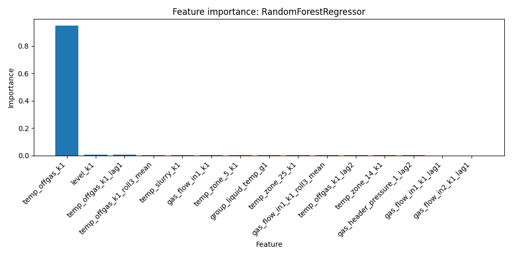

````markdown
# RF / XGBoost Baseline for Soda Carbonation Process

ML-baseline проект для НИР по анализу технологического процесса производства кальцинированной соды.

Цель текущего этапа — быстро построить воспроизводимый baseline и сравнить две модели:

- RandomForestRegressor
- XGBRegressor

Проект используется как основа для дальнейших экспериментов и развития ML-модели управления процессом карбонизации.

---

## Project overview

Процесс карбонизации — сложная нелинейная система, где множество технологических параметров влияет на целевой показатель процесса.

Цель ML-модели: предсказать целевой параметр процесса (например, `k1`) на основе данных датчиков.

Этот репозиторий содержит минимальный pipeline:

`data → preprocessing → feature engineering → training → evaluation → reports`

---

## ML pipeline

```mermaid
flowchart LR
    A[Industrial sensor data] --> B[Data preprocessing]
    B --> C[Feature engineering]
    C --> D[Train/Test split]
    D --> E[Random Forest]
    D --> F[XGBoost]
    E --> G[Model evaluation]
    F --> G
    G --> H[Metrics]
    G --> I[Feature importance]
    G --> J[Reports and plots]
````

---

## Repository structure

```text
rf_tuning_v5
│
├── data/                # входные данные
├── models/              # сохранённые модели
├── nir/                 # текст НИР (структура исследования)
├── reports/             # метрики, графики и отчёты
├── src/                 # код пайплайна
│
├── requirements.txt     # зависимости
└── README.md
```

---

## Data

Данные должны лежать в папке:

```text
data/
```

Пример:

```text
data/baseline_k1_6min_real.csv
```

CSV должен содержать:

| column    | описание                        |
| --------- | ------------------------------- |
| target    | целевая переменная              |
| timestamp | временная колонка (опционально) |

Если присутствует `timestamp`, используется time-based split.

---

## ML pipeline components

### `src/data_prep.py`

* загрузка CSV
* очистка данных
* проверка обязательных колонок
* train/test split

### `src/features.py`

* выбор числовых признаков
* обработка пропусков

### `src/train_baseline.py`

Обучает модели:

* RandomForest
* XGBoost

### `src/evaluate.py`

* вычисляет метрики
* сохраняет отчёты
* строит графики

---

## Running baseline experiment

Установка зависимостей:

```bash
pip install -r requirements.txt
```

Запуск обучения:

```bash
python src/train_baseline.py \
    --data-path data/baseline_k1_6min_real.csv \
    --target target \
    --time-column timestamp
```

Если временной колонки нет:

```bash
python src/train_baseline.py --data-path data/file.csv --target target
```

---

## Generated models

После обучения сохраняются модели:

```text
models/
├── rf_small.joblib
├── rf_medium.joblib
├── xgb_small.joblib
└── xgb_medium.joblib
```

---

## Reports

Все результаты сохраняются в:

```text
reports/
```

Основные файлы:

```text
baseline_metrics.csv
experiments_summary.csv
baseline_report.md
rf_tuning_v5_metrics.csv
rf_tuning_v5_report.md
rf_tuning_v5_experiments_summary.csv
```

---

## Key results

### MAE comparison


### RMSE comparison


### Random Forest feature importance



### XGBoost feature importance


---

## Metrics

Для каждого эксперимента сохраняются:

| metric | описание                     |
| ------ | ---------------------------- |
| MAE    | Mean Absolute Error          |
| RMSE   | Root Mean Squared Error      |
| R²     | Coefficient of determination |

Все эксперименты записываются в:

```text
experiments_summary.csv
```

---

## Visualization

Pipeline автоматически строит:

* сравнение MAE
* сравнение RMSE
* feature importance для RandomForest
* feature importance для XGBoost

---

## Next steps (NIR roadmap)

Дальнейшее развитие проекта:

* расширение feature engineering
* hyperparameter tuning
* временные признаки и лаги
* сравнение моделей
* интеграция в систему поддержки принятия решений

---

## Author

Research project for industrial process modeling using machine learning.

````


