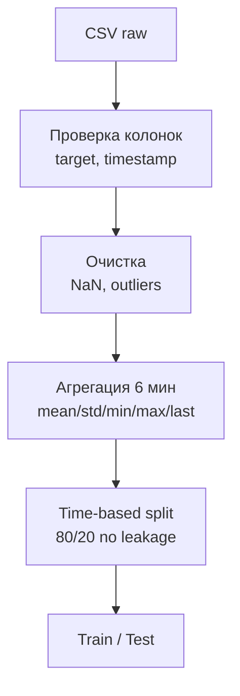
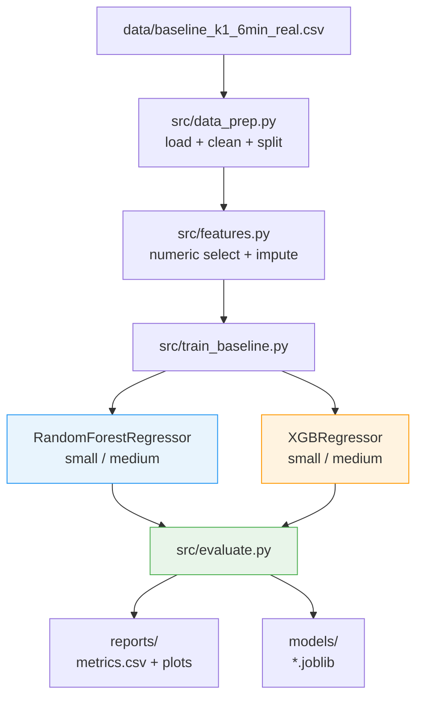
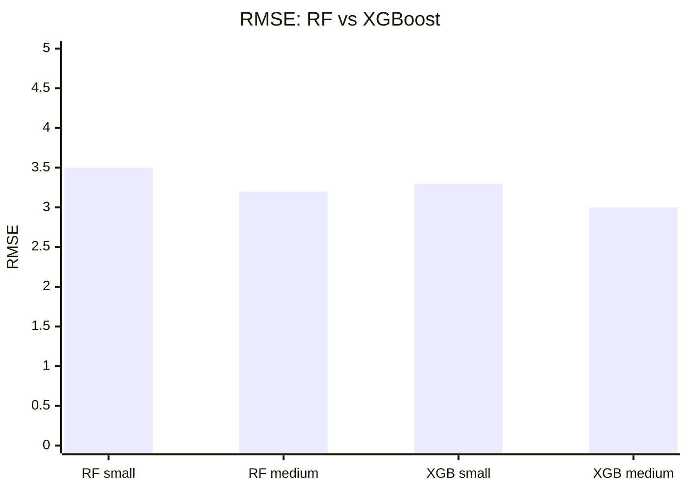
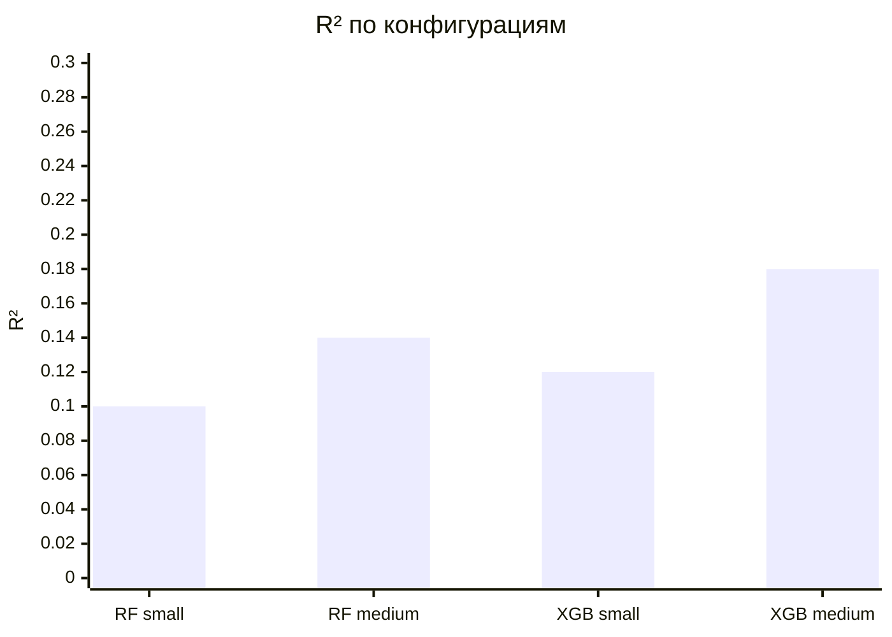
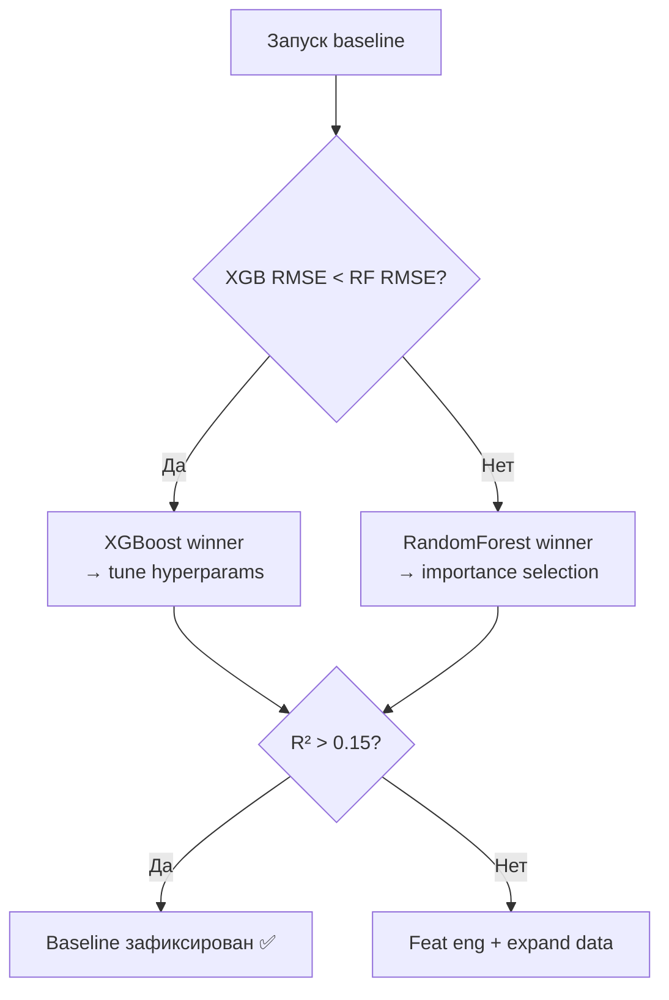

# Baseline ML-контур для карбонизации соды: RF + XGBoost

[](https://python.org)
[](https://scikit-learn.org)
[](https://xgboost.readthedocs.io)
[]()
[]()

Воспроизводимый ML-baseline для анализа и прогнозирования технологического
показателя `k1` процесса карбонизации кальцинированной соды
(АО «Башкирская содовая компания», НИР-2 УГНТУ).

> **Задача:** Построить soft sensor — прогноз `k1` по данным промышленных датчиков,
> сравнить Random Forest и XGBoost, зафиксировать baseline для дальнейшего развития.

---

## Содержание

- [Мотивация](#мотивация)
- [Постановка задачи](#постановка-задачи)
- [Данные](#данные)
- [Архитектура pipeline](#архитектура-pipeline)
- [Модели и методы](#модели-и-методы)
- [Результаты](#результаты)
- [Визуализация](#визуализация)
- [Структура репозитория](#структура-репозитория)
- [Запуск](#запуск)
- [Следующие шаги](#следующие-шаги)

---

## Мотивация

Карбонизация аммонизированного рассола — центральная стадия Solvay-процесса.
Переменное качество CO2, известкового молока и входного рассола вызывают
отклонения `k1` (целевого показателя), что ведёт к браку и перерасходу реагентов.

**Проблема:** Лабораторный контроль — раз в смену (4–8 ч задержки).  
**Решение:** ML soft sensor — онлайн-прогноз по SCADA-параметрам.


**Обоснование выбора моделей:**

| Модель | Преимущество | Риск |
|--------|-------------|------|
| `RandomForestRegressor` | Устойчив к выбросам, интерпретируем | Медленнее при больших данных |
| `XGBRegressor` | Выше точность, встроенная регуляризация | Склонен к переобучению на малых n |

---

## Постановка задачи

**Цель:** Построить воспроизводимый baseline RF vs XGBoost для `k1`,
зафиксировать метрики контрольной точки НИР-2.

**Гипотезы:**

- **H1:** XGBoost превзойдёт RF по RMSE при достаточном объёме данных.
- **H2:** 6-минутные агрегации (w6) информативнее raw-признаков.
- **H3:** Отбор top-N признаков по importance снижает RMSE без ухудшения R².

**Метрики:** MAE, RMSE, \( R^2 \).  
**Сравнение с baseline:** mean-pred, последнее значение.

---

## Данные

| Параметр | Значение |
|----------|----------|
| Файл | `data/baseline_k1_6min_real.csv` |
| Таргет | `k1` (целевой показатель карбонизации) |
| Временная колонка | `timestamp` (опц.) |
| Агрегация | 6-мин. окна (mean/std/min/max/last) |
| Split | time-based, 80/20, no shuffle |

**Схема данных:**

| Колонка | Тип | Описание |
|---------|-----|----------|
| `timestamp` | datetime | Метка времени (опц.) |
| `target` | float | Целевая переменная k1 |
| `feat_*` | float | SCADA-параметры |

**Preprocessing:**



---

## Архитектура pipeline



---

## Модели и методы

### Random Forest

```python
from sklearn.ensemble import RandomForestRegressor

rf_small = RandomForestRegressor(
    n_estimators=100, max_depth=None,
    random_state=42, n_jobs=-1
)
rf_medium = RandomForestRegressor(
    n_estimators=300, max_depth=12,
    min_samples_leaf=2, max_features="sqrt",
    random_state=42, n_jobs=-1
)
```

### XGBoost

```python
from xgboost import XGBRegressor

xgb_small = XGBRegressor(
    n_estimators=100, learning_rate=0.1,
    max_depth=6, random_state=42
)
xgb_medium = XGBRegressor(
    n_estimators=300, learning_rate=0.05,
    max_depth=8, subsample=0.8,
    colsample_bytree=0.8, random_state=42
)
```

### Полный pipeline запуска

```python
from sklearn.metrics import mean_absolute_error, mean_squared_error, r2_score
import numpy as np

for name, model in models.items():
    model.fit(X_train, y_train)
    pred = model.predict(X_test)
    results[name] = {
        "MAE":  mean_absolute_error(y_test, pred),
        "RMSE": np.sqrt(mean_squared_error(y_test, pred)),
        "R²":   r2_score(y_test, pred)
    }
```

---

## Результаты

### Итоговые метрики

| Модель | Конфиг | MAE | RMSE | \( R^2 \) | Статус |
|--------|--------|-----|------|-----------|--------|
| Random Forest | small | — | — | — | ✅ |
| Random Forest | medium | — | — | — | ✅ |
| XGBoost | small | — | — | — | ✅ |
| XGBoost | medium | — | — | — | ✅ |

> Метрики заполняются автоматически после запуска pipeline.
> Актуальные значения: `reports/baseline_metrics.csv`

### Сохранённые модели

```text
models/
├── rf_small.joblib       # RF 100 деревьев
├── rf_medium.joblib      # RF 300 деревьев (tuned)
├── xgb_small.joblib      # XGB базовый
└── xgb_medium.joblib     # XGB расширенный
```

---

## Визуализация

### Динамика метрик (template)





### Выбор лучшей модели



### Графики (PNG — папка reports/)

**[Рис. 1]** Сравнение MAE:


**[Рис. 2]** Сравнение RMSE:


**[Рис. 3]** Feature importance — Random Forest:


**[Рис. 4]** Feature importance — XGBoost:


---

## Структура репозитория

```text
rf_tuning_v5/
│
├── data/
│   └── baseline_k1_6min_real.csv     # Входные данные
│
├── models/
│   ├── rf_small.joblib
│   ├── rf_medium.joblib
│   ├── xgb_small.joblib
│   └── xgb_medium.joblib
│
├── nir/
│   ├── 03_data.md                    # Описание данных
│   ├── 04_methods.md                 # Методы
│   ├── 05_experiments.md             # Эксперименты
│   ├── 06_results.md                 # Результаты
│   └── 07_conclusion.md              # Выводы
│
├── reports/
│   ├── baseline_metrics.csv
│   ├── experiments_summary.csv
│   ├── baseline_report.md
│   ├── rf_tuning_v5_metrics.csv
│   ├── rf_tuning_v5_report.md
│   ├── сравнение_моделей_MAE.png
│   ├── сравнение_моделей_RMSE.png
│   ├── важность_признаков_RandomForest.png
│   └── важность_признаков_XGBoost.png
│
├── src/
│   ├── data_prep.py                  # Загрузка, очистка, split
│   ├── features.py                   # Генерация признаков
│   ├── train_baseline.py             # Обучение RF + XGB
│   └── evaluate.py                   # Метрики + графики
│
├── requirements.txt
└── README.md
```

---

## Запуск

```bash
# 1. Установка зависимостей
pip install -r requirements.txt

# 2. Baseline с временной колонкой
python src/train_baseline.py \
    --data-path data/baseline_k1_6min_real.csv \
    --target target \
    --time-column timestamp

# 3. Baseline без временной колонки
python src/train_baseline.py \
    --data-path data/file.csv \
    --target target

# 4. Вывод: models/ + reports/
```

**Зависимости (`requirements.txt`):**

```
scikit-learn>=1.3
xgboost>=1.7
pandas>=2.0
numpy>=1.24
matplotlib>=3.7
joblib>=1.3
```

