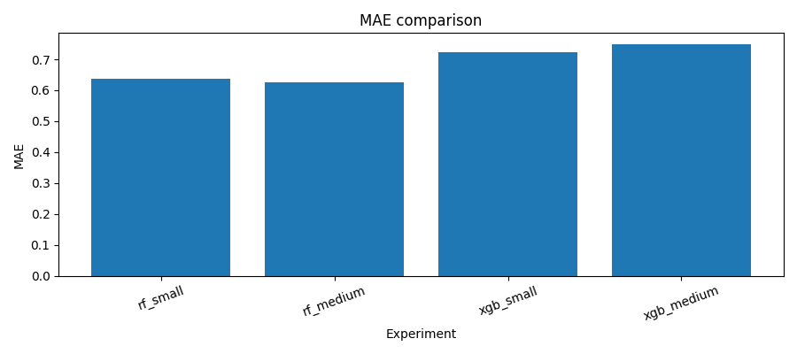
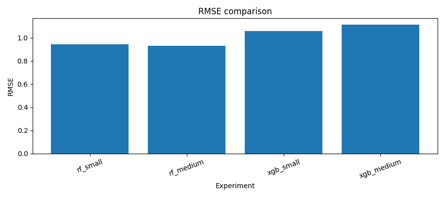
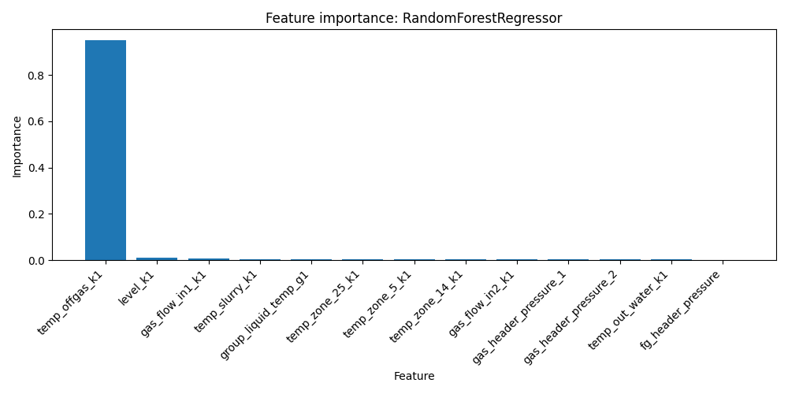
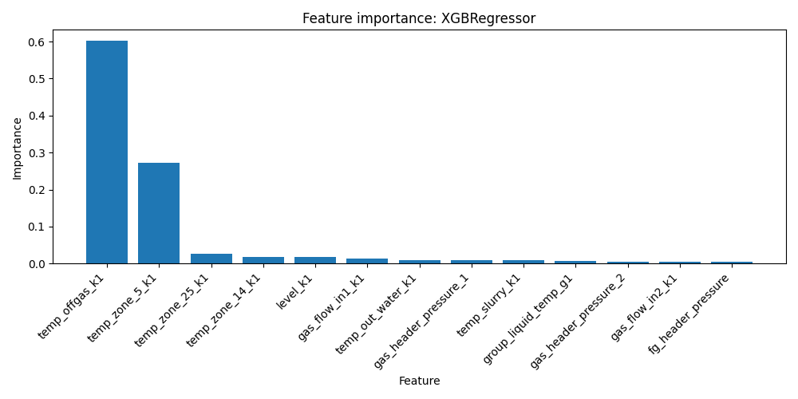

# soda-ml-nir_baseline_v1

Первый baseline-проект НИР по применению машинного обучения для анализа технологического процесса карбонизации при производстве кальцинированной соды.

Это самый ранний этап исследования. Его задача — построить **простой, прозрачный и воспроизводимый baseline-контур машинного обучения**, который показывает, можно ли прогнозировать технологический показатель процесса на коротком горизонте времени.

На этом этапе сравниваются две базовые модели:

- `RandomForestRegressor`
- `XGBRegressor`

---

# Цель проекта

Цель baseline-этапа — построить первую рабочую ML-модель для **краткосрочного прогноза температуры отходящего газа аппарата Кл-1**.

Задача формулируется следующим образом:

**предсказать значение `temp_offgas_k1` через 6 минут (t+6)**  
по текущим технологическим параметрам процесса.

Тип задачи:
- регрессия
- краткосрочный прогноз технологического параметра

---

# Pipeline обучения

Ниже показана схема baseline-pipeline проекта.

```mermaid
flowchart TD

A[SCADA CSV данные] --> B[Загрузка данных]
B --> C[Очистка данных]
C --> D[Подготовка признаков]
D --> E[Time-based split]
E --> F[Обучение моделей]

F --> G1[RandomForest small]
F --> G2[RandomForest medium]
F --> G3[XGBoost small]
F --> G4[XGBoost medium]

G1 --> H[Оценка метрик]
G2 --> H
G3 --> H
G4 --> H

H --> I[Сравнение моделей]
I --> J[Сохранение результатов]

J --> K1[models/]
J --> K2[reports/]
J --> K3[графики]

````

Pipeline выполняет:

1. загрузку и проверку данных
2. подготовку признаков
3. разделение выборки по времени
4. обучение нескольких моделей
5. сравнение результатов
6. сохранение моделей и отчётов

---

# Как устроен baseline-pipeline

Baseline-pipeline реализован как простой и воспроизводимый набор скриптов.

## Основные этапы

### 1. Загрузка данных

Файл:

```
src/data_prep.py
```

Выполняет:

* загрузку CSV
* проверку обязательных столбцов
* удаление некорректных строк
* разделение на train/test

Разделение выполняется **по времени**, а не случайно.

---

### 2. Подготовка признаков

Файл:

```
src/features.py
```

В baseline-версии используется минимальная подготовка:

* выбираются только числовые признаки
* пропуски заменяются на медиану

Это сделано специально, чтобы baseline оставался максимально простым.

---

### 3. Обучение моделей

Файл:

```
src/train_baseline.py
```

Запускаются четыре конфигурации:

| модель       | конфигурация |
| ------------ | ------------ |
| RandomForest | rf_small     |
| RandomForest | rf_medium    |
| XGBoost      | xgb_small    |
| XGBoost      | xgb_medium   |

---

### 4. Оценка моделей

Файл:

```
src/evaluate.py
```

Вычисляются метрики:

* **MAE**
* **RMSE**
* **R²**

Результаты автоматически сохраняются в:

```
reports/
```

---

# Итоговое сравнение моделей

| Модель       | Конфигурация | MAE ↓      | RMSE ↓     | R² ↑       | Итог             |
| ------------ | ------------ | ---------- | ---------- | ---------- | ---------------- |
| RandomForest | rf_medium    | **0.6245** | **0.9311** | **0.8904** | Лучшая           |
| RandomForest | rf_small     | 0.6369     | 0.9426     | 0.8877     | Очень близко     |
| XGBoost      | xgb_small    | 0.7239     | 1.0579     | 0.8585     | Уступает RF      |
| XGBoost      | xgb_medium   | 0.7475     | 1.1113     | 0.8439     | Худший результат |

Главный вывод baseline-этапа:

**RandomForestRegressor показал лучший результат.**

---

# Графическое сравнение моделей

## Сравнение MAE



## Сравнение RMSE



Random Forest демонстрирует более низкую ошибку по сравнению с XGBoost.

---

# Важность признаков

## Random Forest



## XGBoost



Наиболее важный признак:

**`temp_offgas_k1`**

Это говорит о сильной краткосрочной инерционности процесса:
температура через 6 минут сильно зависит от её текущего значения.

---

# Ограничения baseline

Несмотря на хороший результат, baseline имеет несколько ограничений.

1. Это **первый опыт** построения модели.
2. Модель сильно опирается на автокорреляцию сигнала.
3. В baseline пока не используются:

   * лаговые признаки
   * скользящие статистики
   * feature engineering
4. Не тестировались альтернативные target-переменные.

Поэтому baseline нужно рассматривать как **отправную точку исследования**.

---

# Что дальше

Следующие шаги развития проекта:

* убрать сильную зависимость от `temp_offgas_k1`
* добавить лаговые признаки
* протестировать новые target-переменные
* расширить пространство признаков
* сравнить дополнительные модели

---

# Структура проекта

```
soda-ml-nir_baseline_v1
│
├── data
│   └── baseline_k1_6min_real.csv
│
├── src
│   ├── data_prep.py
│   ├── features.py
│   ├── train_baseline.py
│   └── evaluate.py
│
├── models
│
├── reports
│   ├── baseline_metrics.csv
│   ├── experiments_summary.csv
│   ├── baseline_report.md
│   ├── mae_comparison.png
│   ├── rmse_comparison.png
│   ├── rf_feature_importance.png
│   └── xgb_feature_importance.png
│
└── nir
    ├── 01_introduction.md
    ├── 02_domain.md
    ├── 03_data.md
    ├── 04_methods.md
    ├── 05_experiments.md
    ├── 06_results.md
    └── 07_conclusion.md
```

---

# Быстрый запуск baseline

Установить зависимости:

```
pip install -r requirements.txt
```

Запустить baseline:

```
python src/train_baseline.py --data-path data/your_data.csv --target target --time-column timestamp
```

После запуска автоматически создаются:

```
models/
reports/
графики
```

---

# Роль baseline-проекта

`soda-ml-nir_baseline_v1` — это первая контрольная точка проекта.

Его главная ценность:

* доказано, что задача прогнозирования решаема
* построена первая рабочая ML-модель
* зафиксирован baseline для следующих версий

Именно от этой версии далее развиваются:

* `baseline_v2`
* версии с лаговыми признаками
* более сложные ML-модели


```
