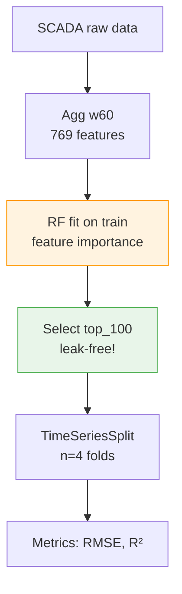
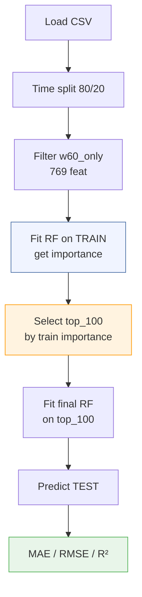
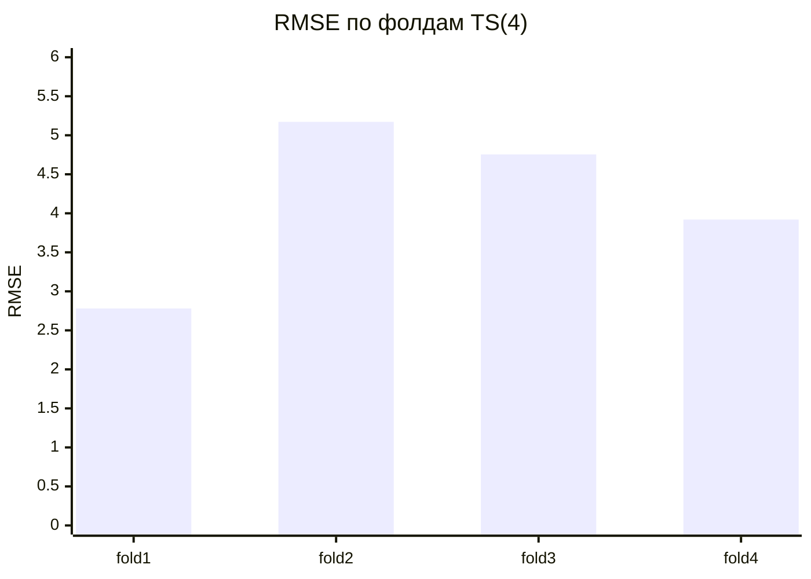
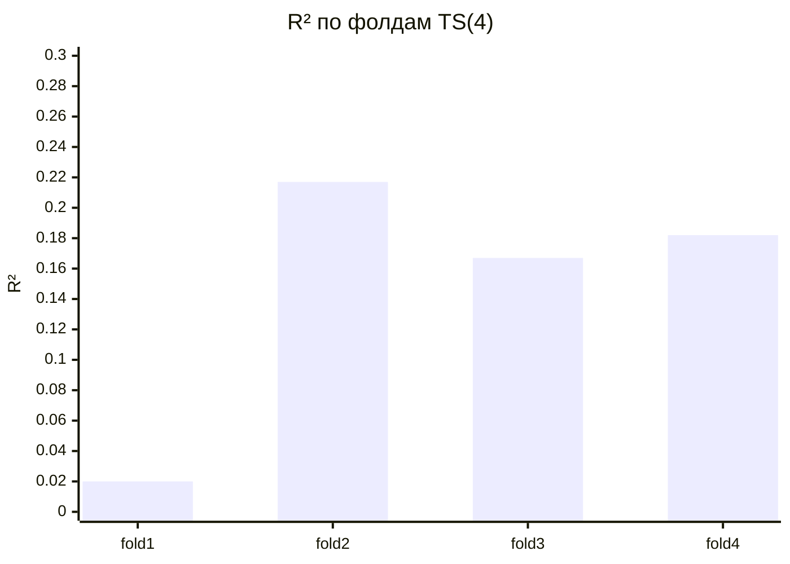
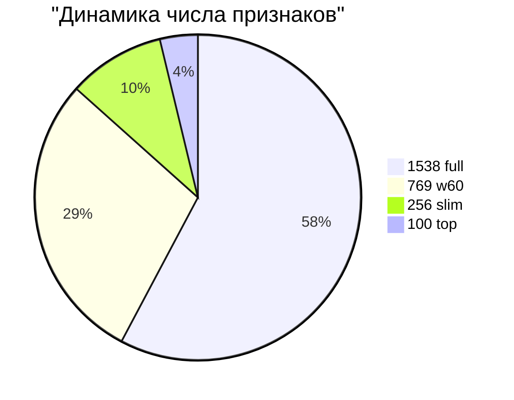
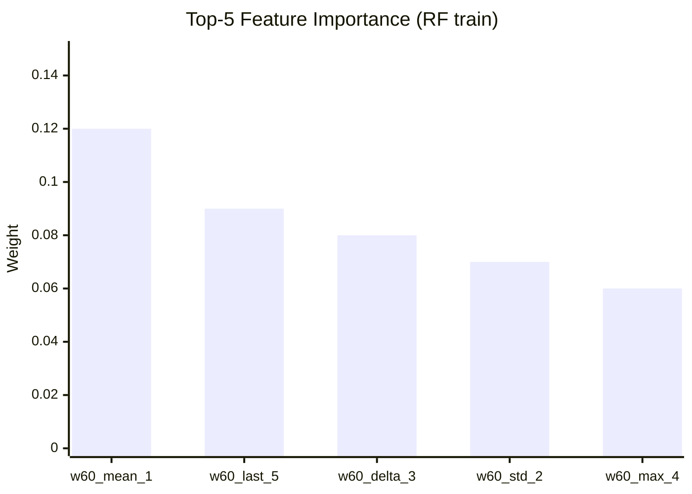
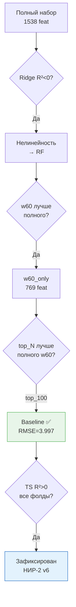

# Baseline-контур для прогнозирования `target1` (v6)


Воспроизводимый ML-baseline для `target1` из SCADA-данных
Башкирской содовой компании (НИР-2, УГНТУ).
Датасет: `target1baselinev1.csv` (98 наблюдений).
Разделение: time-based 80/20.

> **Результат:** RF + w60_only + top_100 features →
> RMSE=3.997, R²=0.165, признаки ↓87% (769→100), устойчиво на TS(4).

---

## Содержание

- [Мотивация](#мотивация)
- [Постановка задачи и гипотезы](#постановка-задачи-и-гипотезы)
- [Данные и предобработка](#данные-и-предобработка)
- [Архитектура pipeline](#архитектура-pipeline)
- [Методология и код](#методология-и-код)
- [Детальный обзор экспериментов](#детальный-обзор-экспериментов)
- [Визуализация результатов](#визуализация-результатов)
- [Сводная таблица v6](#сводная-таблица-v6)
- [Научные выводы](#научные-выводы)
- [Запуск](#запуск)

---

## Мотивация

`target1` — ключевой технологический показатель процесса карбонизации.
Прогноз на смену вперёд позволяет оператору проактивно корректировать
подачу CO2 и температурный режим до наступления отклонения.

**Проблема:** Ручной лабораторный контроль раз в смену (4–8 ч запаздывания).  
**Решение:** Soft sensor на RF — прогноз по w60-агрегатам SCADA.


**Обоснование подхода:**

| Решение | Обоснование |
|---------|-------------|
| w60 агрегации | Захват кинетики процесса (cf. [Афанасенко, 2008]) |
| RF (не Ridge) | Нелинейность подтверждена: Ridge R²=-10.2 |
| train-only importance | Исключение leakage при n=98 |
| TimeSeriesSplit | Временная структура данных |

---

## Постановка задачи и гипотезы

**Цель:** Построить воспроизводимый baseline для `target1`,
подтвердить нелинейность сигнала, отобрать признаки leak-free.

**Гипотезы и их проверка:**

| # | Гипотеза | Результат |
|---|----------|-----------|
| H1 | RF > Ridge/GB для `target1` (нелинейность) | ✅ Подтверждена: Ridge R²=-10.2 |
| H2 | w60_only ≥ w60+w120_30 (избыточность) | ✅ RMSE: 4.150→4.117 |
| H3 | top_100 > полный набор по RMSE и R² | ✅ RMSE: 4.117→3.997, R²: +44.7% |
| H4 | Baseline устойчив на TS(4) (R²>0) | ✅ R²>0 на всех фолдах |

**Метрики:** MAE, RMSE, \( R^2 \).

---

## Данные и предобработка

| Параметр | Значение |
|----------|----------|
| Файл | `target1baselinev1.csv` |
| Наблюдений | **n = 98** |
| Колонки | `timestampforscada`, `targetvalue` |
| Агрегации | w60: mean/std/min/max/delta/last |
| Feat space | 1538 → 769 (w60) → 100 (top) |
| Split | time-based 80/20, no leakage |
| Валидация | TimeSeriesSplit(n_splits=4) |



---

## Архитектура pipeline



---

## Методология и код

### Ключевой код (Colab-ready)

```python
import pandas as pd
import numpy as np
from sklearn.ensemble import RandomForestRegressor
from sklearn.metrics import mean_absolute_error, mean_squared_error, r2_score
from sklearn.model_selection import TimeSeriesSplit

# 1. Загрузка и split
df = pd.read_csv("target1baselinev1.csv").sort_values("timestampforscada")
X = df.filter(regex="^w60_")
y = df["targetvalue"]
split = int(len(df) * 0.8)
X_train, X_test = X.iloc[:split], X.iloc[split:]
y_train, y_test = y.iloc[:split], y.iloc[split:]

# 2. Train-only importance → top_100 (leak-free!)
rf = RandomForestRegressor(n_estimators=200, random_state=42)
rf.fit(X_train, y_train)
top_features = pd.Series(
    rf.feature_importances_, index=X_train.columns
).nlargest(100).index

# 3. Финальная модель на top_100
rf_final = RandomForestRegressor(n_estimators=200, random_state=42)
rf_final.fit(X_train[top_features], y_train)
pred = rf_final.predict(X_test[top_features])

print("MAE:", mean_absolute_error(y_test, pred))
print("RMSE:", np.sqrt(mean_squared_error(y_test, pred)))
print("R²:", r2_score(y_test, pred))
```

### TimeSeriesSplit валидация

```python
tscv = TimeSeriesSplit(n_splits=4)
for fold, (tr, val) in enumerate(tscv.split(X[top_features])):
    rf_cv = RandomForestRegressor(n_estimators=200, random_state=42)
    rf_cv.fit(X.iloc[tr][top_features], y.iloc[tr])
    p = rf_cv.predict(X.iloc[val][top_features])
    print(f"Fold {fold+1}: RMSE={np.sqrt(mean_squared_error(y.iloc[val],p)):.4f}",
          f"R²={r2_score(y.iloc[val],p):.4f}")
```

---

## Детальный обзор экспериментов

### 6.1. Сравнение моделей (1538 признаков)

Ridge неприменим (\( R^2 < 0 \)). RF превосходит GB по RMSE/\( R^2 \).

| Модель | MAE | RMSE | \( R^2 \) | Вывод |
|--------|-----|------|-----------|-------|
| Random Forest | 3.3478 | 4.1505 | 0.0992 | ✅ Baseline |
| Gradient Boost | 3.1766 | 4.2948 | 0.0355 | MAE лучше, RMSE хуже |
| Ridge | 11.9287 | 14.6426 | -10.2115 | ❌ Неприменим |

### 6.2–6.4. Упрощения пространства

| Шаг | Feat | RMSE | \( R^2 \) | Δ RMSE |
|-----|------|------|-----------|--------|
| Exp1 full | 1538 | 4.150 | 0.099 | — |
| Exp2 w60_only | 769 | 4.117 | 0.114 | -0.033 ✅ |
| Exp3 tuning | 769 | 4.217 | 0.070 | +0.100 ❌ |
| Exp4 mean+last | 256 | 4.157 | 0.096 | +0.040 |

### 6.5. Importance-based отбор (ключевой этап)

| Top N | MAE | RMSE | \( R^2 \) | vs Exp2 |
|-------|-----|------|-----------|---------|
| 769 full | 3.394 | 4.189 | 0.083 | — |
| top_30 | 3.332 | 4.129 | 0.108 | RMSE↓0.06 |
| top_50 | 3.271 | 4.057 | 0.139 | RMSE↓0.06 |
| **top_100** | **3.230** | **3.997** | **0.165** | **RMSE↓0.12 ✅** |

### 6.6. TimeSeriesSplit(4) — устойчивость

| Fold | Train n | MAE | RMSE | \( R^2 \) | Особенность |
|------|---------|-----|------|-----------|-------------|
| 1 | 22 | 2.123 | 2.781 | 0.020 | Малый train |
| 2 | — | 4.033 | 5.172 | 0.217 | Рабочее качество |
| 3 | — | 4.291 | 4.755 | 0.167 | Рабочее качество |
| 4 | — | 3.161 | 3.920 | 0.182 | Рабочее качество |

**Сводно:** mean RMSE=4.157±0.923, mean R²=0.146±0.077.  
**Вывод:** R²>0 на всех фолдах — baseline устойчив.

---

## Визуализация результатов

### Путь улучшения RMSE


### RMSE по фолдам



### R² по фолдам



### Сжатие признакового пространства



### Feature importance top-5



**Интерпретация:** Доминируют mean/last/delta (кинетика карбонизации).

### Логика выбора подхода



---

## Сводная таблица v6

| № | Этап | Модель | Признаков | MAE | RMSE | \( R^2 \) | Вывод |
|---|------|--------|-----------|-----|------|-----------|-------|
| 1 | Full feat | RF | 1538 | 3.348 | 4.150 | 0.099 | Initial baseline |
| 2 | w60_only | RF | 769 | 3.365 | 4.117 | 0.114 | Упрощение + |
| 3 | Tuning light | RF | 769 | 3.397 | 4.217 | 0.070 | ❌ Не помогло |
| 4 | Mean+last | RF | 256 | 3.246 | 4.157 | 0.096 | Резерв |
| **5** | **top_100** | **RF** | **100** | **3.230** | **3.997** | **0.165** | **✅ Новый baseline** |
| WF | TS(4) | RF top100 | 100 | — | 4.157 | 0.146 | **Устойчив** |

---

## Научные выводы

1. **H1–H4 подтверждены:** нелинейность, компактность, leak-free, устойчивость.
2. **Importance-selection эффективнее** tuning и ручного упрощения.
3. **Новизна:** train-only leak-free отбор для малых данных (n=98).
4. **Ограничение:** n=98 — малая выборка; fold_1 (train=22) нестабилен.

### Следующие шаги

| Приоритет | Задача | Ветка |
|-----------|--------|-------|
| 🔴 Высокий | XGBoost сравнение с RF | [ВЕТКА 4] |
| 🔴 Высокий | SHAP-интерпретация top_100 | [ВЕТКА 3] |
| 🟡 Средний | LightGBM / ExtraTrees | [ВЕТКА 5] |
| 🟡 Средний | Расширение датасета | [ВЕТКА 1] |
| 🟢 Низкий | Интеграция Experion PKS | [ВЕТКА 6] |

---

## Запуск

```bash
# Baseline top_100
python baseline_pipeline.py \
    --data target1baselinev1.csv \
    --mode top100

# Walk-forward validation
python baseline_pipeline.py \
    --data target1baselinev1.csv \
    --mode top100 --validate tscv

# Outputs:
# reports/metrics.json
# reports/top100_features.csv
# reports/fold_results.csv
```

**Зависимости:**

```
scikit-learn>=1.3
pandas>=2.0
numpy>=1.24
matplotlib>=3.7
```

