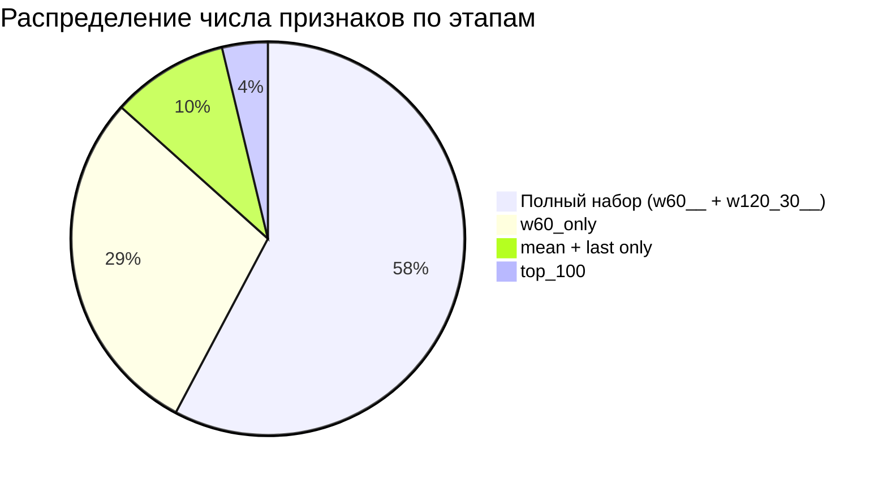

```markdown
# Baseline‑контур для прогнозирования `target1`

## Краткое описание

Проект содержит результаты серии экспериментов по построению воспроизводимого baseline‑контура машинного обучения для технологического показателя `target1`. В ходе работы тестировались различные конфигурации моделей и признаковых пространств, проводился отбор признаков и проверка устойчивости результата.


## Ключевые результаты

**Итоговый baseline:**

* **Модель:** `RandomForestRegressor` (базовые параметры).
* **Признаковое пространство:** `w60_only`.
* **Отбор признаков:** `top_100` по важности (`feature importance`), рассчитанной на обучающей выборке.
* **Улучшение относительно Experiment 2:**
    * RMSE: с $4{,}116668$ до $3{,}996800$;
    * $R^2$: с $0{,}113823$ до $0{,}164679$;
    * число признаков: с 769 до 100.

**Устойчивость:** подтверждена через `TimeSeriesSplit(n_splits=4)`.

## Сводная таблица результатов

| Этап эксперимента | Конфигурация модели | Число признаков | MAE | RMSE | $R^2$ | Ключевой вывод |
|---------------|------------------|--------------|----|----|------|-------------|
| Experiment 1 | Random Forest на `w60__ + w120_30__` | 1538 | $3{,}347818$ | $4{,}150467$ | $0{,}099212$ | Исходный baseline, применимость нелинейной модели |
| Experiment 2 | Random Forest на `w60_only` | 769 | $3{,}365045$ | $4{,}116668$ | $0{,}113823$ | Упрощение улучшило baseline |
| Experiment 3 | Random Forest tuning light | 769 | $3{,}397348$ | $4{,}217209$ | $0{,}070008$ | Тюнинг без работы с признаками не помог |
| Experiment 4 | Random Forest на `mean + last only` | 256 | $3{,}245783$ | $4{,}156987$ | $0{,}096379$ | Сильное сжатие возможно, но лучший baseline не получен |
| Experiment 5 (top_30) | Random Forest на `top_30` | 30 | $3{,}332403$ | $4{,}129147$ | $0{,}108442$ | Компактный вариант, близкий к baseline |
| Experiment 5 (top_50) | Random Forest на `top_50` | 50 | $3{,}270822$ | $4{,}056952$ | $0{,}139346$ | Уверенное улучшение относительно `exp_02` |
| **Experiment 5 (top_100)** | **Random Forest на `top_100`** | **100** | **$3{,}229928$** | **$3{,}996800$** | **$0{,}164679$** | **Новый лучший рабочий baseline** |
| Walk‑forward | `top_100`, TimeSeriesSplit(4) | 100 | — | mean $4{,}157308$ | mean $0{,}146179$ | Baseline рабоче устойчив |

## Визуализация результатов

### График 1. Сравнение RMSE по этапам экспериментов

```mermaid
graph LR
    A[Experiment 1] -->|4.150| B[Experiment 2]
    B -->|4.117| C[Experiment 3]
    C -->|4.217| D[Experiment 4]
    D -->|4.157| E[Experiment 5 (top_30)]
    E -->|4.129| F[Experiment 5 (top_50)]
    F -->|4.057| G[Experiment 5 (top_100)]
    G -->|3.997| H[Walk‑forward (mean)]
```

### График 2. Сравнение $R^2$ по этапам экспериментов

```mermaid
graph LR
    A[Experiment 1] -->|0.099| B[Experiment 2]
    B -->|0.114| C[Experiment 3]
    C -->|0.070| D[Experiment 4]
    D -->|0.096| E[Experiment 5 (top_30)]
    E -->|0.108| F[Experiment 5 (top_50)]
    F -->|0.139| G[Experiment 5 (top_100)]
    G -->|0.165| H[Walk‑forward (mean)]
```

### График 3. Результаты временной валидации (TimeSeriesSplit)

| Фолд | MAE | RMSE | $R^2$ |
|------|-----|-----|------|
| `fold_1` | $2{,}122904$ | $2{,}781229$ | $0{,}019812$ |
| `fold_2` | $4{,}033000$ | $5{,}172466$ | $0{,}216860$ |
| `fold_3` | $4{,}291105$ | $4{,}755381$ | $0{,}166539$ |
| `fold_4` | $3{,}160833$ | $3{,}920155$ | $0{,}181504$ |

### График 4. Сокращение числа признаков



## Проверка устойчивости (TimeSeriesSplit)

**Сводные показатели:**
* mean RMSE = $4{,}157308$, std RMSE = $0{,}922905$;
* mean $R^2$ = $0{,}146179$, std $R^2$ = $0{,}076943$.

**Вывод:** baseline демонстрирует приемлемую устойчивость на нескольких временных срезах. Даже на маленькой обучающей выборке (`train = 22`) $R^2$ не уходит в отрицательную область.

## Ограничения текущей серии экспериментов

1. **Малый объём выборки** (98 наблюдений) — ограничивает статистическую устойчивость выводов.
2. **Одноцелевая постановка** — исследование выполнено для одного контура (`target1`) и одного датасета.
3. **Валидация без переотбора признаков** — walk‑forward выполнялся для фиксированного `top_100`, а не для полного pipeline.
4. **Отсутствие технологической интерпретации** — качество оценивается только по статистическим метрикам (MAE, RMSE, $R^2$).

## Выводы и дальнейшие шаги

**Итоги:**
* построен воспроизводимый baseline‑контур: `Random Forest + w60_only + top_100 features`;
* достигнуто улучшение качества (RMSE, $R^2$) и сокращение числа признаков (769 → 100);
* устойчивость подтверждена временной валидацией.

**Дальнейшие шаги:**
1. расширение признаковой инженерии;
2. интерпретация важности признаков с технологической точки зрения;
3. тестирование ансамблей и других моделей;
4. перенос логики на другие target‑переменные;
5. оценка практической полезности модели для управления процессом.

---
2. Создайте файл `README.md` в корне вашего репозитория на GitHub.
3. Вставьте скопированный текст.
4
