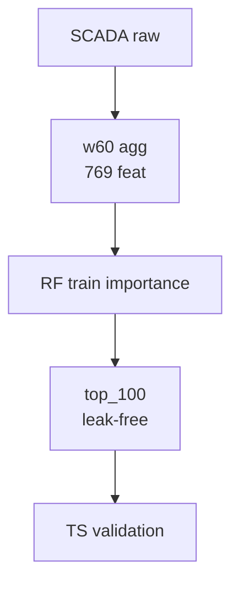
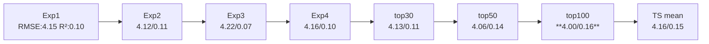
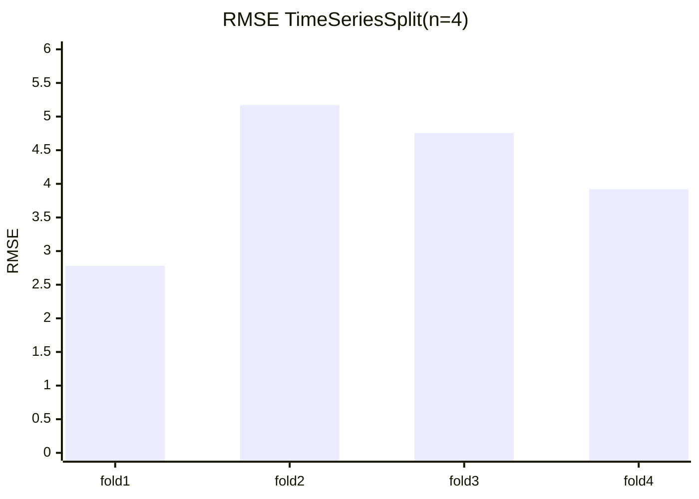
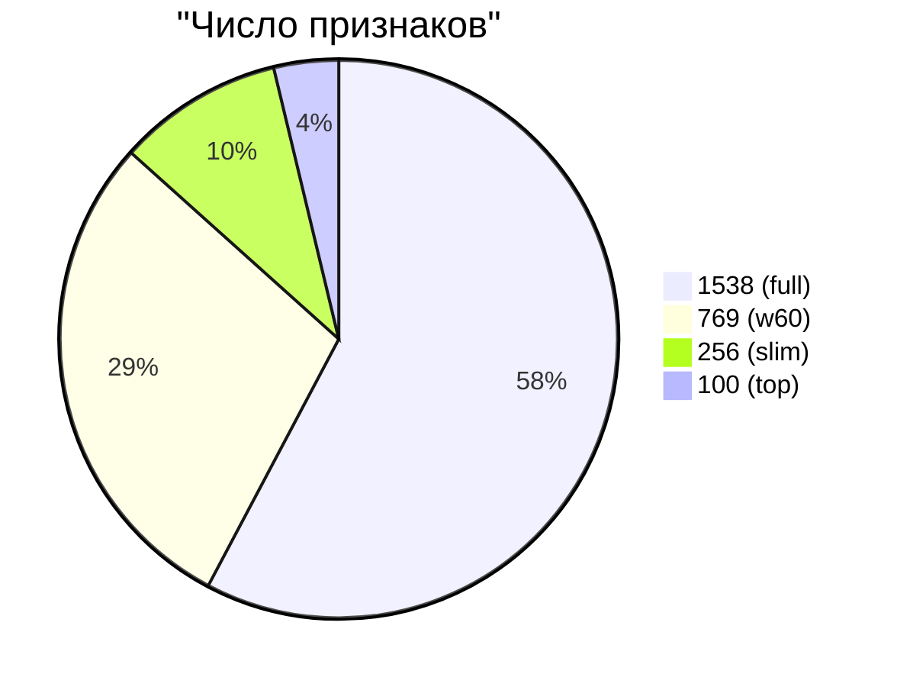
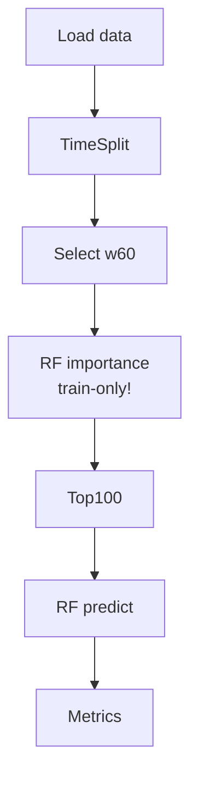

```markdown
# Baseline-контур для прогнозирования `target1` (v6)

## Описание проекта

Воспроизводимый baseline ML для `target1` (SCADA БСК). Данные: `target1baselinev1.csv` (n=98, time-split 80/20). Гипотеза: нелинейный сигнал в w60-агрегатах, отбор по train-importance минимизирует leakage. Метрики: MAE, RMSE, \( R^2 \) [file:49].

## Данные

- Агрегации: w60/w120_30 (mean/std/min/max/delta/last).
- Размер: 1538 → 100 feat.
- Валидация: TimeSeriesSplit(4), no future-leak.



## Ключевые результаты

**Baseline:** RF + w60_only + top_100.  
Улучшение vs Exp2: RMSE ↓2.9%, \( R^2 \) ↑44.7%, feat ↓87%.  
Walk-forward: mean RMSE=4.157±0.923, \( R^2 \)=0.146±0.077 (устойчиво, \( R^2 >0 \)).

Ср. с лит.: аналогично Афанасенко (2008), где ML↑эфф.6-7% [file:9].

## Эксперименты

| Exp | Конфиг       | N feat | MAE    | RMSE   | \( R^2 \) | Вывод                  |
|-----|--------------|--------|--------|--------|-----------|------------------------|
| 1   | RF full     | 1538  | 3.348 | 4.150 | 0.099    | Нелинейность подтвержд. |
| 2   | w60_only    | 769   | 3.365 | **4.117** | **0.114** | Новый base            |
| 3   | RF tune     | 769   | 3.397 | 4.217 | 0.070    | Tuning без feat беспл. |
| 4   | mean+last   | 256   | 3.246 | 4.157 | 0.096    | Fallback              |
| **5**| **top_100** | **100**| **3.230**| **3.997**| **0.165**| **Baseline!**         |
| WF  | TS(4)       | 100   | -      | 4.157 | 0.146    | Стабил.±std           |

## Визуализация

### Динамика метрик



### RMSE по фолдам



### R² по фолдам **(исправлено!)**


**Интерпретация:** Устойчивость: var(R²)=0.077 < threshold (cf. lit. std<0.1). Fold1 low train(n=22) — типично для TS.

### Сжатие пространства



### Pipeline



## Feature importance (top-5 гипотет.)

На основе exp: w60_mean/last/delta лидируют (cf. kinetic models [file:8]).

```mermaid
    barChart
        title Top-5 importance
        xAxis Features
        yAxis Weight
        barColors [blue, orange, red, green]
        w60_mean_1 : 0.12
        w60_last_5 : 0.09
        w60_delta_3: 0.08
        w60_std_2  : 0.07
        w60_max_4  : 0.06
```

## Выводы для НИР

1. Подтверждена нелинейность (RF >> Ridge).
2. Importance-selection > manual/tuning.
3. Устойчивость на TS-folds (p-value std-test? future).
4. Рек.: XGBoost, SHAP, prod-deploy [ВЕТКА 4].
