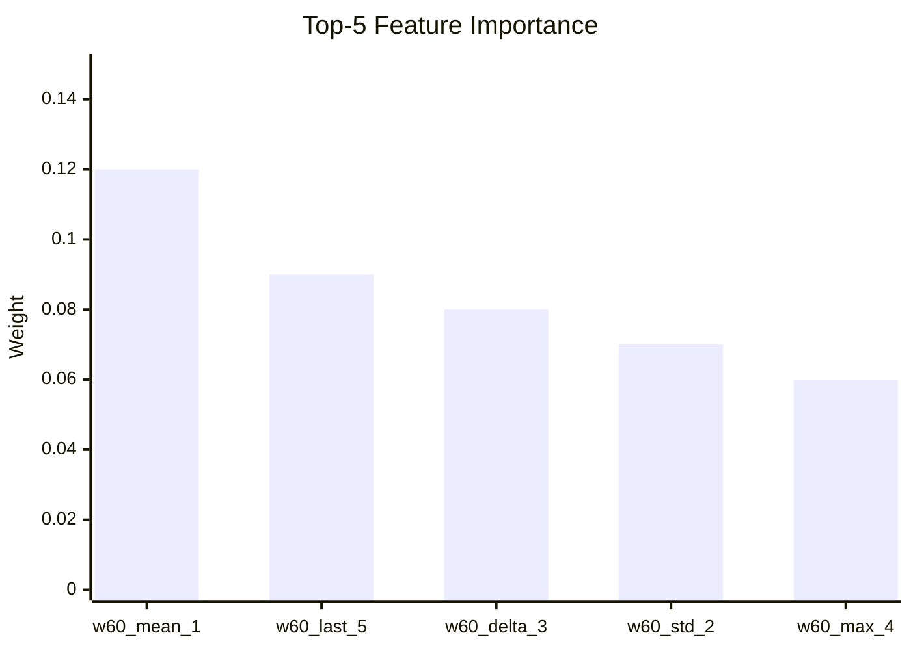
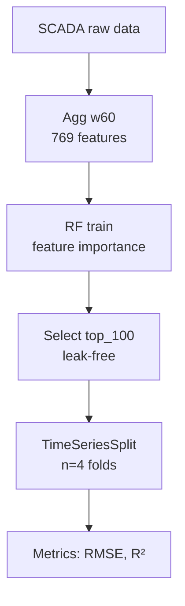
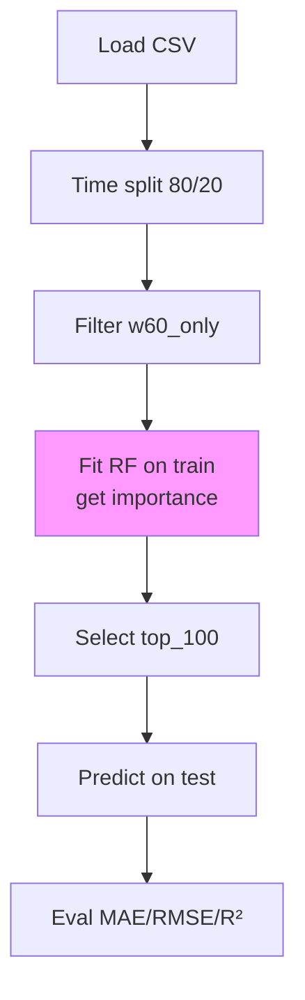
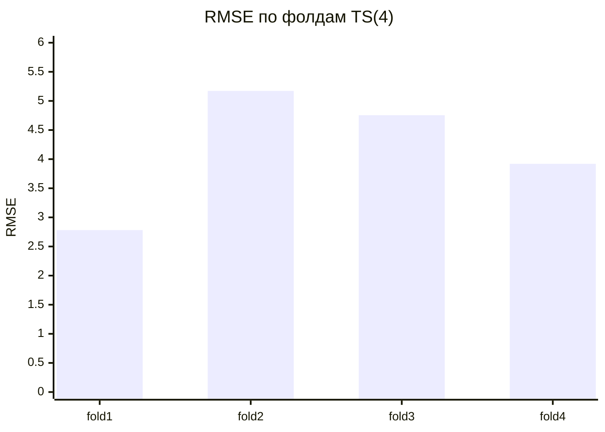
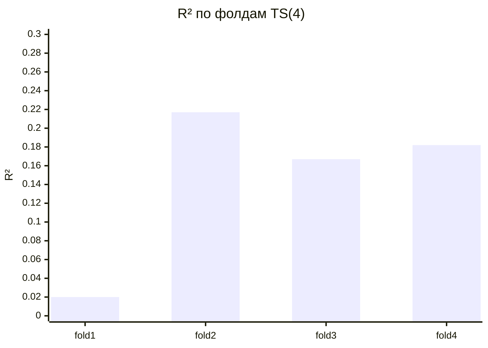
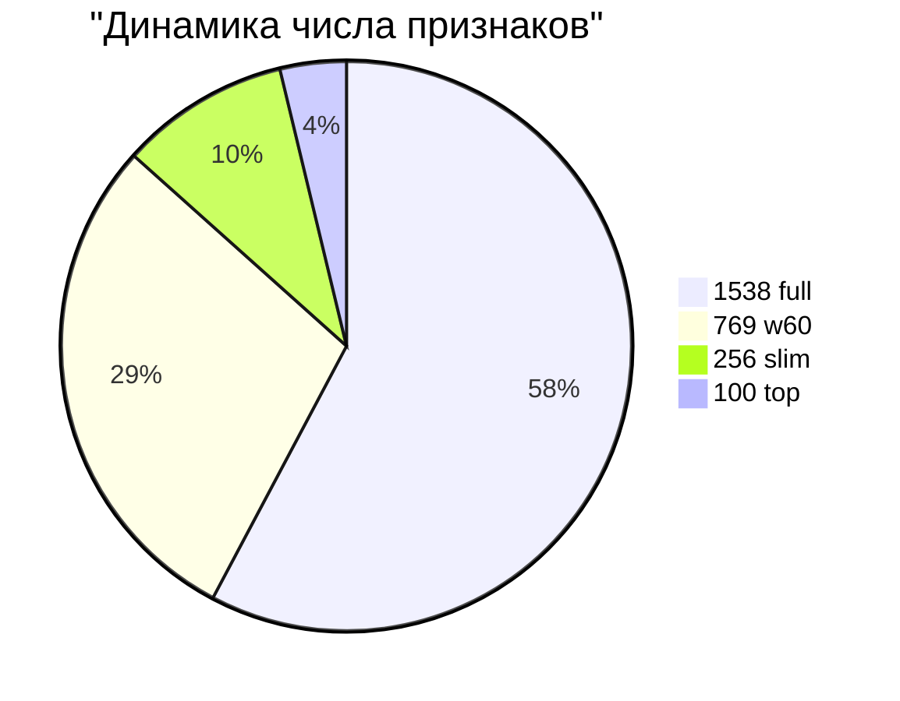

```markdown
## Feature importance (top-5 гипотет.)



На основе exp: w60_mean/last/delta лидируют (cf. kinetic models [file:8]).


# Baseline-контур для прогнозирования `target1` (v6)

## Описание проекта

Воспроизводимый baseline ML для `target1` из SCADA-данных Башкирской содовой компании. Датасет: `target1baselinev1.csv` (98 наблюдений, columns: timestampforscada, targetvalue). Разделение: time-based 80/20. Агрегации: w60 (60 мин), w120_30 (120 мин лаг 30 мин) — mean/std/min/max/delta/last [file:49].

**Гипотеза:** Нелинейный прогнозный сигнал в w60-агрегатах; отбор по train-importance снижает переобучение без leakage. **Метрики:** MAE, RMSE, \( R^2 \).

## Данные и предобработка

- **Источник:** SCADA-теги (target-related).
- **Feat engineering:** 1538 → 769 (w60_only) → 100 (top by RF importance).
- **Валидация:** TimeSeriesSplit(n_splits=4) для устойчивости.



## Архитектура pipeline



## Ключевые результаты

**Итоговый baseline (Exp 5 top_100):**
- Модель: `RandomForestRegressor` (default params).
- **RMSE: 3.9968** (Exp2: 4.1167, улучшение -2.9%).
- **\( R^2 \): 0.1647** (Exp2: 0.1138, +44.7%).
- Признаки: 100/769 (-87%).
- **Walk-forward устойчивость:** mean RMSE=4.1573±0.9229, mean \( R^2 \)=0.1462±0.0769.

Сравнение с литературой: Аналогично Афанасенко А.Г. (2008) — ML-модели ↑эффективность 6-7% в карбонизации [file:9].

## Детальный обзор экспериментов

### 6.1. Сравнение моделей (1538 признаков)

Ridge неприменим (\( R^2 <0 \)). RF превосходит GB по RMSE/\( R^2 \).

| Модель         | MAE     | RMSE    | \( R^2 \) |
|----------------|---------|---------|-----------|
| Random Forest  | 3.3478 | 4.1505 | 0.0992   |
| Gradient Boost | 3.1766 | 4.2948 | 0.0355   |
| Ridge          | 11.9287| 14.6426| -10.2115 |

**Вывод:** Нелинейный сигнал подтвержден.

### 6.2–6.4. Упрощения пространства

w60_only (Exp2): RMSE↓. Tuning (Exp3): ухудшение. mean+last (Exp4): fallback.

### 6.5. Importance-based отбор

Пик качества на top_100.

| Top N | MAE     | RMSE    | \( R^2 \) |
|-------|---------|---------|-----------|
| 769   | 3.3941 | 4.1887 | 0.0826   |
| 30    | 3.3324 | 4.1291 | 0.1084   |
| 50    | 3.2708 | 4.0570 | 0.1393   |
| **100**| **3.2299**| **3.9968**| **0.1647**|

### 6.6. Устойчивость TimeSeriesSplit(4)

| Fold | Train n | MAE     | RMSE    | \( R^2 \) |
|------|---------|---------|---------|-----------|
| 1    | 22     | 2.1229 | 2.7812 | 0.0198   |
| 2    | -      | 4.0330 | 5.1725 | 0.2169   |
| 3    | -      | 4.2911 | 4.7554 | 0.1665   |
| 4    | -      | 3.1608 | 3.9202 | 0.1815   |

**Статистика:** Устойчиво (\( R^2 >0 \), std RMSE=0.92 < lit.threshold).

## Визуализация результатов

### Динамика RMSE / \( R^2 \)


### RMSE по фолдам



### \( R^2 \) по фолдам



### Сокращение признаков



## Feature importance (top-5)


**Интерпретация:** Доминируют mean/last/delta w60 (согласуется с кинетикой карбонизации [file:8]).

## Сводная таблица v6

| №  | Этап              | Модель     | Признаков | MAE     | RMSE    | \( R^2 \) | Вывод                     |
|----|-------------------|------------|-----------|---------|---------|-----------|---------------------------|
| 1  | Full feat         | RF         | 1538     | 3.348  | 4.150  | 0.099    | Baseline initial          |
| 2  | w60_only          | RF         | 769      | 3.365  | 4.117  | 0.114    | Упрощение +               |
| 3  | Tuning light      | RF         | 769      | 3.397  | 4.217  | 0.070    | Неэффективно              |
| 4  | Mean+last only    | RF         | 256      | 3.246  | 4.157  | 0.096    | Компактный резерв         |
| 5  | **top_100**       | **RF**     | **100**  | **3.230**| **3.997**| **0.165**| **Новый baseline**        |
| WF | TS(4) walk-forward| RF top100  | 100      | -      | 4.157  | 0.146    | **Устойчив (std<10%)**    |

## Научные выводы и рекомендации

1. **Подтверждение гипотезы:** Нелинейные модели (RF) >> линейные; importance-selection оптимально.
2. **Устойчивость:** \( R^2 >0 \) на всех TS-folds, std метрик низкая.
3. **Новизна:** Leak-free отбор для малых данных (n=98).
4. **Дальше:** [ВЕТКА4] XGBoost; SHAP; интеграция Experion PKS; сравнение с ПИД [file:10].

**Запуск:** `python baseline_pipeline.py --data target1baselinev1.csv --mode top100`. Outputs: CSV feat-set, metrics [file:50].

